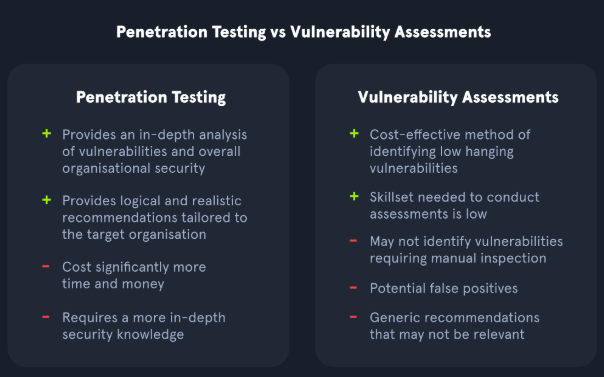
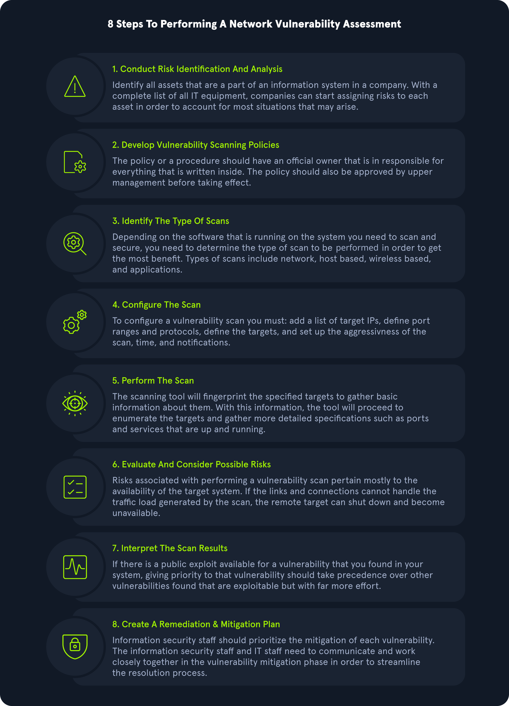
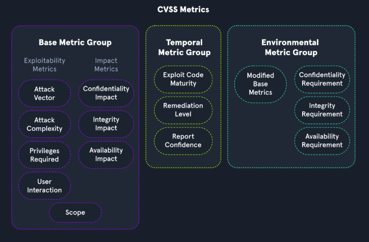

# Table of Contents
- [Vulnerability Assessment](#vulnerability-assessment)
- [Penetration Test (Pentest)](#penetration-test-pentest)
- [Differenza tra Vulnerability Assessment e Pentest](#differenza-tra-vulnerability-assessment-e-pentest)
- [Altri Tipi di Valutazioni della Sicurezza](#altri-tipi-di-valutazioni-della-sicurezza)

# Valutazioni di Sicurezza (Security Assessments)
Le valutazioni di sicurezza servono a identificare e correggere i punti deboli di reti, computer e applicazioni prima che vengano sfruttati da malintenzionati. La scelta del test più adatto dipende dal livello di maturità informatica dell'organizzazione.

## Vulnerability Assessment
* Consiste nell'analizzare la rete o i sistemi confrontandoli con standard di sicurezza (es. GDPR, OWASP) e checklist.
* Utilizza strumenti automatici (scanner) integrati da una verifica manuale per confermare l'esistenza delle vulnerabilità.
* Non sfrutta le falle trovate: non esegue mai l'escalation dei privilegi o il movimento laterale all'interno della rete.
* È adatto a qualsiasi organizzazione, comprese quelle con un livello di maturità di sicurezza iniziale.

## Penetration Test (Pentest)
* È una simulazione autorizzata e legale di un attacco informatico per verificare se e come un aggressore possa penetrare nei sistemi.
* È indicato per organizzazioni con un livello di maturità medio-alto.
* Si suddivide in tre modalità d'accesso:
  * **Black Box:** Il tester non ha alcuna conoscenza della rete (simula un attaccante esterno).
  * **Grey Box:** Il tester possiede informazioni limitate, paragonabili a quelle di un normale dipendente.
  * **White Box:** Il tester ha accesso completo a codice sorgente, documentazione e architettura per identificare ogni possibile difetto.
* Può focalizzarsi su settori specifici: Applicativo (web, mobile, API), Infrastruttura di rete, Sicurezza fisica (accessi alle sedi) o Ingegneria Sociale (phishing e manipolazione delle persone).

## Differenza tra Vulnerability Assessment e Pentest
* **Vulnerability Assessment:** Identifica "cosa" non va e quali vulnerabilità note sono presenti (ampiezza di analisi).
* **Pentest:** Dimostra "come" le vulnerabilità possono essere usate per compromettere la rete e qual è l'impatto reale dell'attacco (profondità di analisi).

## Altri Tipi di Valutazioni della Sicurezza

| Tipo di Valutazione | Descrizione | Obiettivo / Contesto |
| :--- | :--- | :--- |
| **Security Audit** | Verifiche obbligatorie imposte da enti esterni o normative (es. PCI-DSS per chi gestisce pagamenti con carte). | Verificare la conformità legale e normativa. |
| **Bug Bounty** | Programmi che offrono ricompense economiche a esperti esterni per ogni vulnerabilità segnalata. | Adatto ad aziende con alta maturità e risorse dedicate al triage dei report (es. Apple, Microsoft). |
| **Red Team Assessment** | Simulazione evasiva di un attacco reale condotta da esperti offensivi con un obiettivo finale preciso (es. sottrarre dati critici). | Valutare la capacità della difesa di rilevare e bloccare attacchi complessi. |
| **Purple Team Assessment** | Esercitazione congiunta in cui il team offensivo (Red Team) e quello difensivo (Blue Team) lavorano insieme. | Testare e ottimizzare la capacità di risposta alle minacce in tempo reale. |

# Vulnerability Assessment e Asset Management

Un Vulnerability Assessment ha lo scopo di identificare e categorizzare i rischi di sicurezza senza sfruttare manualmente le vulnerabilità. Comprende spesso la definizione delle azioni correttive (remediation) e richiede un'accurata inventarizzazione degli asset aziendali.

## Metodologia

## Concetti Chiave

* **Vulnerabilità:** Una debolezza o bug nel sistema (applicazioni, reti, infrastruttura). Viene catalogata tramite il sistema MITRE CVE e valutata con il punteggio CVSS (da 0 a 10) in base ad parametri quali vettore d'attacco, complessità e impatto su riservatezza, integrità e disponibilità.
* **Minaccia (Threat):** Un processo o evento che aumenta la probabilità che una vulnerabilità venga sfruttata da un malintenzionato.
* **Exploit:** Codice o risorse utilizzate per sfruttare una vulnerabilità (es. reperibili su database pubblici come Exploit-DB o repository GitHub).
* **Rischio:** La possibilità che gli asset o i dati subiscano danni. Si calcola incrociando l'impatto potenziale e la probabilità che una vulnerabilità venga sfruttata.

### Sintesi delle Differenze
* **Rischio:** Qualcosa di negativo che potrebbe accadere.
* **Minaccia:** Un evento o azione negativa in corso o imminente.
* **Vulnerabilità:** La debolezza che permette alla minaccia di concretizzarsi.

## Asset Management e Inventario dei Dati

Per proteggere l'infrastruttura, un'organizzazione deve prima conoscere tutti gli asset in suo possesso. L'inventario deve includere sia la componente hardware/network sia i dati archiviati.

| Categoria Asset | Componenti e Risorse da Includere |
| :--- | :--- |
| **Dati On-Premises** | Hard disk (HDD/SSD) di PC e server, unità esterne, supporti ottici, flash media (USB) e tecnologie legacy (nastri, floppy). |
| **Dati in Cloud** | Spazi di archiviazione gestiti tramite provider di servizi Cloud (AWS, GCP, Microsoft Azure), inclusi ambienti multi-cloud. |
| **Applicazioni SaaS** | Dati memorizzati in servizi software di terzi (es. Google Drive, Microsoft 365, Dropbox, Teams). |
| **Applicazioni Aziendali** | Software operativi utilizzati dall'azienda, sia installati localmente sia erogati in modalità cloud. |
| **Dispositivi di Rete** | Hardware di rete fisico e di sicurezza (router, firewall, switch, hub, sistemi IDS/IPS, sistemi DLP). |

# Standard di Valutazione della Sicurezza (Assessment Standards)

Sia i penetration test sia i vulnerability assessment devono rispettare standard specifici per essere accreditati e riconosciuti legalmente o da enti governativi. Tali standard garantiscono che le analisi siano condotte in modo rigoroso e condiviso, aumentando l'efficienza dei controlli e riducendo il rischio di attacchi per l'organizzazione.

## Standard di Conformità (Compliance Standards)

Ogni ente regolatore stabilisce i propri requisiti di sicurezza a cui le organizzazioni devono attenersi per ottenere e mantenere l'accreditamento. Queste certificazioni sono fondamentali sia per attestare la sicurezza dei sistemi tramite verifiche di terze parti, sia per operare sul mercato, poiché molte aziende richiedono tali requisiti per stipulare contratti.

### 1. Payment Card Industry Data Security Standard (PCI DSS)
* **Contesto:** Standard applicato a qualsiasi organizzazione che memorizza, elabora o trasmette dati relativi alle carte di credito (es. banche, e-commerce come Amazon). Non è una legge statale, ma una regolamentazione obbligatoria definita dal settore bancario.
* **Requisiti principali:** Impone scansioni di vulnerabilità interne ed esterne. I dati delle carte devono risiedere in un ambiente isolato e segregato dalla rete aziendale ordinaria, denominato **Cardholder Data Environment (CDE)**, per limitare gli accessi e prevenire compromissioni.

### 2. Health Insurance Portability and Accountability Act (HIPAA)
* **Contesto:** Normativa statunitense volta a tutelare i dati sanitari e personali dei pazienti.
* **Requisiti principali:** Non richiede esplicitamente scansioni automatizzate, ma impone la conduzione di risk assessment e l'identificazione formale delle vulnerabilità per mantenere l'accreditamento.

### 3. Federal Information Security Management Act (FISMA)
* **Contesto:** Insieme di linee guida e standard statunitensi per la protezione delle operazioni e delle informazioni della pubblica amministrazione e dei suoi fornitori.
* **Requisiti principali:** Richiede la documentazione e la prova concreta di un programma attivo di gestione delle vulnerabilità per garantire disponibilità, riservatezza e integrità dei sistemi IT.

### 4. ISO 27001
* **Contesto:** Standard di gestione della sicurezza delle informazioni riconosciuto a livello internazionale. Si basa sulla creazione e sul mantenimento di un **Information Security Management System (ISMS)**.
* **Requisiti principali:** Richiede alle organizzazioni di eseguire scansioni di vulnerabilità interne ed esterne con cadenza almeno trimestrale.

> **Nota:** Sebbene la compliance sia fondamentale per i requisiti legali e di business, non deve essere l'unico fattore a guidare la sicurezza. La gestione delle vulnerabilità deve essere modellata sulle specificità dell'infrastruttura e sul livello di propensione al rischio (risk appetite) dell'organizzazione.

---

## Standard per i Penetration Test

I penetration test non devono mai essere eseguiti senza regole o linee guida prestabilite. Prima dell'inizio dell'attività è obbligatorio definire un **ambito operativo (scope)** preciso e stipulare un contratto legale firmato che stabilisca cosa sia autorizzato e cosa no.

I tester devono ridurre al minimo l'impatto sui sistemi ed evitare modifiche persistenti (come il cambio delle password degli utenti). Inoltre, l'estrazione di dati riservati dalla rete del cliente deve essere limitata: spesso uno screenshot dei nomi delle cartelle o dei file è sufficiente a dimostrare la vulnerabilità senza esfiltrare informazioni sensibili.

### Framework e Metodologie di Pentesting

| Framework | Nome Esteso | Descrizione e Fasi Chiave |
| :--- | :--- | :--- |
| **PTES** | *Penetration Testing Execution Standard* | Standard applicabile a qualsiasi tipologia di pentest. Definisce 7 fasi operative: 1. Pre-engagement Interactions 2. Intelligence Gathering 3. Threat Modeling 4. Vulnerability Analysis 5. Exploitation 6. Post Exploitation 7. Reporting |
| **OSSTMM** | *Open Source Security Testing Methodology Manual* | Metodologia incentrata sulla misurazione operativa della sicurezza, integrabile con altri standard. Si suddivide in 5 canali di test: • Human Security (ingegneria sociale) • Physical Security • Wireless Communications (WiFi, Bluetooth) • Telecommunications • Data Networks |
| **NIST** | *NIST Penetration Testing Framework* | Modello definito dal National Institute of Standards and Technology. Si articola in 4 fasi principali: 1. Planning 2. Discovery 3. Attack 4. Reporting |
| **OWASP** | *Open Web Application Security Project* | Punto di riferimento globale per la sicurezza applicativa. Mantiene metodologie specifiche tra cui: • **WSTG:** Web Security Testing Guide • **MSTG:** Mobile Security Testing Guide • **Firmware Security Testing Methodology** |

# Sistema di Valutazione delle Vulnerabilità (CVSS e DREAD)

Il **Common Vulnerability Scoring System (CVSS)** è lo standard di settore utilizzato per calcolare e categorizzare la gravità delle vulnerabilità informatiche, permettendo alle organizzazioni di dare priorità agli interventi di rimodulazione. Molti scanner applicano direttamente questi punteggi, ma è fondamentale comprendere la logica di calcolo per giustificare le valutazioni o eseguire calcoli manuali.

## Il Modello Microsoft DREAD

Affiancato spesso al CVSS per l'analisi del rischio, **DREAD** è un modello sviluppato da Microsoft basato su una scala da 1 a 10 per valutare minacce e vulnerabilità attraverso 5 fattori chiave:

* **Damage Potential:** Entità del danno causabile dallo sfruttamento della vulnerabilità.
* **Reproducibility:** Facilità con cui l'attacco può essere ripetuto con successo.
* **Exploitability:** Grado di sforzo e competenze richieste per l'esecuzione dell'attacco.
* **Affected Users:** Quantità di utenti o sistemi impattati dall'evento.
* **Discoverability:** Facilità con cui la vulnerabilità può essere individuata da un attaccante.

## Struttura del Punteggio CVSS

Il punteggio finale di una vulnerabilità in ambito CVSS è determinato dalla combinazione di tre gruppi principali di metriche: **Base**, **Temporale** e **Ambientale**.

### 1. Base Metric Group (Metriche di Base)
Rappresenta le caratteristiche intrinseche e immutabili di una vulnerabilità. Si suddivide in due categorie:

#### Metriche di Sfruttabilità (Exploitability Metrics)
Valutano le modalità tecniche necessarie per eseguire l'attacco:
* **Attack Vector (Vettore d'Attacco):** Contesto di accesso (es. Rete, Adiacente, Locale, Fisico).
* **Attack Complexity (Complessità dell'Attacco):** Condizioni necessarie non sotto il diretto controllo dell'attaccante.
* **Privileges Required (Privilegi Richiesti):** Livello di autorizzazioni necessario prima di tentare l'attacco.
* **User Interaction (Interazione Utente):** Requisito che un utente compia un'azione (es. cliccare un link).

#### Metriche di Impatto (Impact Metrics - CIA triade)
Rappresentano le conseguenze di un attacco riuscito in termini di Riservatezza, Integrità e Disponibilità:

| Metrica di Impatto | Gravità Alta | Gravità Bassa |
| :--- | :--- | :--- |
| **Confidentiality (Riservatezza)** | Furto di credenziali, chiavi crittografiche o dati altamente sensibili. | Accesso a informazioni non critiche o di ridotto valore per l'organizzazione. |
| **Integrity (Integrità)** | Modifica non autorizzata di file di business critici o del sistema operativo. | Impossibilità di controllare specificamente l'entità o la tipologia dei dati alterati. |
| **Availability (Disponibilità)** | Interruzione totale dei servizi o dei sistemi aziendali (Denial of Service completo). | Blocco parziale: gli utenti mantengono l'accesso ad alcune risorse aziendali. |

### 2. Temporal Metric Group (Metriche Temporali)
Misura lo stato di evoluzione della vulnerabilità nel tempo in base alle risorse esterne disponibili:

* **Exploit Code Maturity (Maturità del Codice di Exploit):**
  * *Not Defined:* Metrica saltata nel calcolo.
  * *High:* Esiste un exploit funzionante in modo costante e automatizzato.
  * *Functional:* Codice di exploit pubblico e funzionante.
  * *Proof-of-Concept (PoC):* Esiste una PoC che richiede modifiche per un attacco reale.
  * *Unproven:* Nessun codice di exploit disponibile al momento.
* **Remediation Level (Livello di Soluzione):**
  * *Not Defined:* Metrica saltata.
  * *Unavailable:* Nessuna patch o soluzione disponibile.
  * *Workaround:* Soluzione non ufficiale temporanea fornita dalla community o dal team interno.
  * *Temporary Fix:* Correzione temporanea ufficiale rilasciata dal vendor in attesa della patch.
  * *Official Fix:* Patch ufficiale definitiva rilasciata dal vendor.
* **Report Confidence (Affidabilità del Report):**
  * *Not Defined:* Metrica saltata.
  * *Confirmed:* Dettagli tecnici confermati da molteplici fonti affidabili.
  * *Reasonable:* Informazioni pubblicate, ma con dettagli insufficienti per riprodurre l'attacco con certezza.
  * *Unknown:* Dettagli della vulnerabilità non confermati o poco chiari.

### 3. Environmental Metric Group (Metriche Ambientali)
Consente alle organizzazioni di personalizzare il punteggio CVSS in base al proprio contesto operativo e alla propria propensione al rischio.

* **Modified Base Metrics (Metriche di Base Modificate):** Consente di ricalibrare i valori del trilatero CIA (Valori: *Not Defined*, *High*, *Medium*, *Low*). 
  * *High:* L'impatto su un elemento CIA avrebbe conseguenze catastrofiche per l'organizzazione.
  * *Medium:* Effetti significativi ma gestibili.
  * *Low:* Effetti minimi sulle operazioni di business.

## Calcolo del Punteggio CVSS

L'algoritmo di calcolo (es. **CVSS v3.1**) combina le metriche di base, temporali e ambientali per generare un valore numerico da **0.0 a 10.0**. Il calcolo ufficiale può essere eseguito tramite la calcolatrice fornita dal National Vulnerability Database (NVD).

* **Esempio:** La vulnerabilità di Remote Code Execution in *Windows Print Spooler* (PrintNightmare) presenta un punteggio **CVSS Base pari a 8.8** (Livello *High/Critical*), determinato da un vettore d'attacco di rete combinato con un alto impatto sul trilatero CIA.

# Common Vulnerabilities and Exposures (CVE)

Per standardizzare la valutazione delle vulnerabilità e la classificazione delle minacce, la community della cybersecurity utilizza linguaggi e cataloghi condivisi a livello globale.

## Open Vulnerability Assessment Language (OVAL)

**OVAL** è uno standard internazionale libero per valutare e descrivere lo stato di sicurezza e le configurazioni di un sistema senza dover eseguire l'exploit diretto delle vulnerabilità. Supportato dal Department of Homeland Security (DHS) e dal NIST, fa parte dello **SCAP (Security Content Automation Protocol)** per l'automazione della compliance e del vulnerability management.

### Il Processo OVAL
1. **Identificazione:** Individuazione delle configurazioni del sistema da testare.
2. **Valutazione:** Analisi dello stato corrente del sistema.
3. **Report:** Divulgazione delle informazioni (gli stati principali includono: *Vulnerable*, *Non-compliant*, *Installed Asset*, *Patched*).

### Definizione e Struttura XML
I dati OVAL sono forniti in formato XML per consentire l'analisi automatica da parte di scanner come Nessus. Esistono 4 classi principali di definizioni:
* **OVAL Vulnerability Definitions:** Identifica le vulnerabilità del software.
* **OVAL Compliance Definitions:** Verifica se la configurazione rispetta le policy di sicurezza.
* **OVAL Inventory Definitions:** Rileva la presenza di uno specifico software.
* **OVAL Patch Definitions:** Verifica se una patch specifica è installata.

* **Formato ID Univoco:** `oval:NomeDominioOrganizzazione:TipoID:ValoreID`
  * *Tipi di ID:* `definition` (def), `object` (obj), `state` (ste), `variable` (var).
  * *Esempio:* `oval:org.mitre.oval:obj:1116`

## Common Vulnerabilities and Exposures (CVE)

Il **CVE** è un catalogo pubblico gestito da MITRE e sponsorizzato dal DHS che assegna un identificativo unico e standardizzato a ogni vulnerabilità o esposizione nota, includendo una descrizione tecnica e riferimenti. Gli ID sono assegnati dalle **CNA (CVE Numbering Authorities)**.

### Le 9 Fasi per l'Ottenimento di un CVE

1. **Verifica della Rilevanza:** Verificare che il problema sia un vero bug di sicurezza che richiede una modifica al codice e che non esista già un CVE registrato.
2. **Contatto con il Vendor:** Contattare in buona fede il produttore del software interessato.
3. **Identificazione della CNA:** Determinare se il vendor è una CNA autorizzata o se rivolgersi a coordinatori terzi.
4. **Richiesta via Web Form:** Inviare la richiesta diretta al team CVE se non ci sono CNA di riferimento.
5. **Conferma della Richiesta:** Ricezione della mail di conferma ed eventuale invio di ulteriori dettagli tecnici.
6. **Assegnazione dell'ID CVE:** Il team CVE assegna l'ID (in questa fase **non è ancora pubblico**).
7. **Divulgazione Pubblica (Public Disclosure):** Annuncio coordinato tra vendor e ricercatori per evitare l'assegnazione di ID duplicati.
8. **Annuncio Ufficiale:** Pubblicazione formale specificando i dettagli delle vulnerabilità distinte.
9. **Invio Informazioni al Catalogo:** Invio dei dettagli finali al team CVE e al National Vulnerability Database (NVD).

## Responsible Disclosure e Concetto di Zero-Day

La **Responsible Disclosure** (Divulgazione Responsabile) è la pratica etica in cui un ricercatore di sicurezza segnala una vulnerabilità direttamente e privatamente al vendor, concedendogli il tempo necessario per sviluppare e rilasciare una patch prima di rendere noti i dettagli al pubblico.

* **Conseguenze della Mancata Responsible Disclosure:** Se la vulnerabilità viene resa pubblica prima della patch, gli attaccanti possono sfruttarla per scopi criminali. Un difetto di sicurezza noto ma non ancora patchato dal vendor viene definito **Zero-Day (0-day)**.

## Esempi di CVE di Alto Impatto

| CVE ID | Vulnerabilità | Descrizione e Impatto |
| :--- | :--- | :--- |
| **CVE-2020-5902** | F5 BIG-IP TMUI RCE | Vulnerabilità di **Remote Code Execution (RCE) non autenticata** nell'interfaccia di gestione di F5 BIG-IP. Consente il controllo completo del sistema remoto, esecuzione di codice e modifica dei servizi. |
| **CVE-2021-34527** | PrintNightmare | Vulnerabilità di **RCE autenticata** nel servizio Windows Print Spooler dovuta a una gestione errata dei privilegi nelle operazioni sui file. Consente l'acquisizione del controllo totale di server (inclusi Domain Controller) e Workstation. |