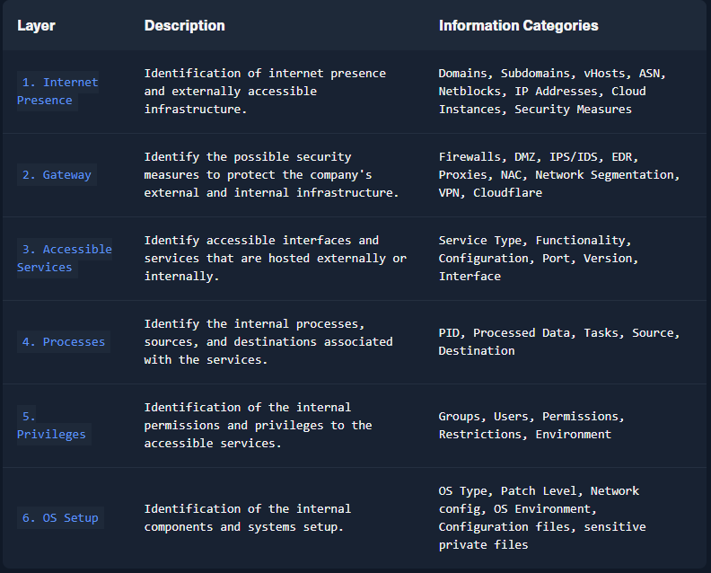
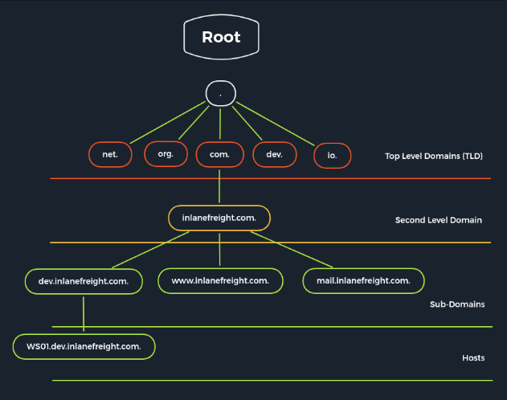
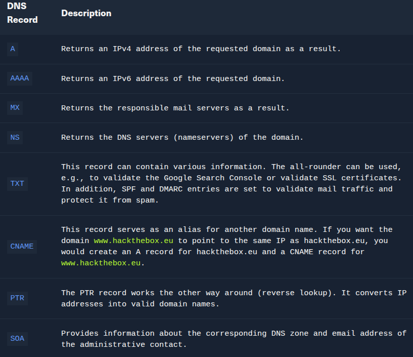

# Indice
- [Metodologia di enumerazione](#metodologia-di-enumerazione)
  - [Layer1: internet presence](#layer1-internet-presence)
  - [Layer2: gateway](#layer2-gateway)
  - [Layer3: accessible services](#layer3-accessible-services)
  - [Layer4: processes](#layer4-processes)
  - [Layer5: privileges](#layer5-privileges)
  - [Layer6: os setup](#layer6-os-setup)
- [Domain information](#domain-information)
  - [Online presence](#online-presence)
    - [Ricognizione passiva](#ricognizione-passiva)
    - [Certificate transparency](#certificate-transparency)
    - [Identificazione server aziendali](#identificazione-server-aziendali)
    - [Analisi record dns](#analisi-record-dns)
  - [Cloud Resources](#cloud-resources)
  - [Staff](#staff)
- [FTP](#ftp)
  - [Default configuration](#default-configuration)
  - [Dangerous settings](#dangerous-settings)
  - [Download a file](#download-a-file)
  - [Upload a file](#upload-a-file)
  - [Footprinting the service](#footprinting-the-service)
- [SMB](#smb)
  - [Samba](#samba)
    - [Default configuration](#default-configuration-1)
    - [Dangerous settings](#dangerous-settings-1)
    - [Restart samba](#restart-samba)
    - [SMBclient - Connecting to the Share](#smbclient---connecting-to-the-share)
    - [Download Files from SMB](#download-files-from-smb)
  - [Footprinting the service](#footprinting-the-service-1)
    - [RPC](#rpc)
    - [Brute forcing user RIDs](#brute-forcing-user-rids)
- [NFS](#nfs)
  - [Dangerous settings](#dangerous-settings-2)
  - [Footprinting the service](#footprinting-the-service-2)
- [DNS](#dns)
  - [Struttura dei server dns nel mondo](#struttura-dei-server-dns-nel-mondo)
  - [Default configuration](#default-configuration-2)
  - [Dangerous settings](#dangerous-settings-3)
  - [Footprinting the service](#footprinting-the-service-3)
    - [Subdomain brute forcing](#subdomain-brute-forcing)
- [SMTP](#smtp)
  - [Default configuration](#default-configuration-3)
  - [Dangerous settings](#dangerous-settings-4)
  - [Footprinting the Service](#footprinting-the-service-4)
- [IMAP/POP3](#imappop3)
  - [IMAP commands](#imap-commands)
  - [POP3 commands](#pop3-commands)
  - [Dangerous settings](#dangerous-settings-5)
  - [Footprinting the service](#footprinting-the-service-5)
- [SNMP](#snmp)
  - [Default configuration](#default-configuration-4)
  - [Dangeorus settings](#dangeorus-settings)
  - [Footprinting the service](#footprinting-the-service-6)
- [MySql](#mysql)
  - [Dangerous settings](#dangerous-settings-7)
- [MSSQL](#mssql)
- [Oracle TNS](#oracle-tns)
  - [Default configuration](#default-configuration-5)
  - [Setting and testing ODAT](#setting-and-testing-odat)
- [IPMI](#ipmi)

Pen testing and also enumeration are dynamic processes. Metodologia strutturata su 6 livelli e rappresenta i confini che cerchiamo di superare con il processo di enumerazione. Il processo di enumerazione è diviso in tre livelli a partire dal piu esterno:
1. infrastructure-based enumeration (primi due livelli della metodologia)
2. host-based enumeration (successivi due livelli)
3. os-based enumeration (ultimi due livelli piu interni)

Per ogni layer abbimo due sottolivelli (partiamo da infrastructure-based):
1. internet presence
2. gateway 
3. accessible services
4. processes
5. privileges
6. OS setup

## Layer1: internet presence
Trovare traget su cui investigare. **Obiettivo**: identificare tutti i sistemi target e interfacce da poter testare

## Layer2: gateway
Capire l'interfaccio del target, come è protetta e dove è localizzata. **Obiettivo**: capire con cosa abbiamo a che fare e a cosa dobbiamo fare attenzione.

## Layer3: accessible services
**Obiettivo**:  mira a comprendere la ragione dell'esistenza e la funzionalità del sistema target e ad acquisire le conoscenze necessarie per comunicare con esso e sfruttarlo efficacemente per i nostri scopi.

## Layer4: processes
**Obiettivo**: capire quali processi si attivano e identificare le dipendenze fra loro

## Layer5: privileges
Ogni servizio gira sotto uno specifico utente o gruppo con autorizzazioni e privilegi concessi dall'amministratore del sistema. **Obiettivo**: fondamentale identificarli e comprendere cosa è possibile e cosa non è possibile con questi privilegi.

## Layer6: os setup
Collezionare info riguardanti il so e il suo setup. **Obiettivo**: scoprire come l'amministratore gestire i sistemi e quali info sensibili possiamo ricavarne

# Domain information
Raccogliere info e capire le tecnologie e la stuttura necessarie per i servizi. Info raccolte in modo passivo, navigare mascherati da clienti.  Raccolta passiva: servizi di terze parti per capire la compagnia, vedere il sito principale, ricordando quali tecnologie e strutture servono per determinati servizi offerti. Combinazione di quello che vediamo e di quello che non vediamo

## Online presence
Dopo aver compreso le basi della azienda e i suoi servizi, cerchiamo una  prima traccia della sua presenza in internet. Per esempio attraverso il suo certificato ssl che possiamo esaminare a partire dal suo sito web.

### Ricognizione passiva
La ricognizione passiva consiste nel raccogliere informazioni sfruttando servizi di terze parti ed esaminando il sito web principale comportandosi come normali visitatori o clienti.

- Perché si fa: Evita di generare allarmi nei sistemi difensivi (IDS/IPS) del bersaglio.
- L'Approccio dello Sviluppatore: Per capire la struttura invisibile dell'azienda, bisogna guardare i servizi attivi dal punto di vista di chi li ha creati, associando ogni servizio alle sue necessità tecniche sottostanti.

### Certificate transparency
Un punto di partenza fondamentale è lo studio dei certificati SSL/TLS della ditta. Lo standard (RFC 6962) impone alle autorità di certificazione (come Let's Encrypt) di registrare pubblicamente ogni certificato emesso in registri chiamati Certificate Transparency Logs. *crt.sh*: È un motore di ricerca web che interroga questi log storici.
Utilità: Permette di scoprire sottodomini dimenticati o nascosti (es. matomo.inlanefreight.com, smartfactory.inlanefreight.com) semplicemente leggendo la cronologia dei vecchi certificati richiesti dall'azienda.

### Identificazione server aziendali 
Una volta ottenuta una lista di sottodomini, il testo mostra un ciclo for in Bash per identificare quali host appartengano all'infrastruttura diretta dell'azienda e quali a terze parti (es. AWS). Non è consentito testare server di terze parti senza autorizzazione. Con comando *host* troviamo ip del dominio, poi possiamo usare shodan per trovare eventuali port aperte di quel ip

- Shodan: È un motore di ricerca per dispositivi connessi a Internet (IoT, server, router).
- Utilità: Invece di fare una scansione attiva con Nmap (che verrebbe intercettata), si interroga Shodan inserendo gli IP trovati. Shodan restituisce le porte aperte, i banner dei software (es. nginx, Apache httpd) e le versioni memorizzate nei suoi database durante le sue scansioni globali quotidiane.

### Analisi record dns
Il comando dig any inlanefreight.com interroga il server DNS per ottenere tutti i record disponibili in un colpo solo. Il testo si concentra sul valore strategico dei TXT Records. I record TXT contengono stringhe di testo usate per la verifica del dominio o per la sicurezza delle e-mail (SPF, DMARC). Dall'analisi di questi record, l'attaccante scopre quali servizi esterni usa l'azienda, aprendo nuovi scenari di attacco.  
Let us look at what we have learned here and come back to our principles. We see an IP record, some mail servers, some DNS servers, TXT records, and an SOA record.
- A records: We recognize the IP addresses that point to a specific (sub)domain through the A record. Here we only see one that we already know.
- MX records: The mail server records show us which mail server is responsible for managing the emails for the company. Since this is handled by google in our case, we should note this and skip it for now.
- NS records: These kinds of records show which name servers are used to resolve the FQDN to IP addresses. Most hosting providers use their own name servers, making it easier to identify the hosting provider.
- TXT records: this type of record often contains verification keys for different third-party providers and other security aspects of DNS, such as SPF, DMARC, and DKIM, which are responsible for verifying and confirming the origin of the emails sent. Here we can already see some valuable information if we look closer at the results.

## Cloud Resources
Anche se il provider del cloud rendono sicura la loro infrastruttura conetralmente, non significa che le compagnie che usano il cloud lo siano, dipende dalla configurazione dell'amministratore. Partiamo da s3 bucket (amazon), blobs (Azure micr), cloud storage (gcp), che possono essere accessi senza autenticazione se configurati male.
- for i in $(cat subdomainlist);do host $i | grep "has address" | grep inlanefreight.com | cut -d" " -f1,4;done
- combinare google search con google dorks, per esempio *inurl:amazonaws.com/blob.core.windows.net* e *intext:* per raffinare la ricerca
- provider di terze parti come [domain.glass](https://domain.glass/) ci dicono molto sull'infrastruttura della compagnia.
- un altro provider utile è [grayhatwarfare](https://buckets.grayhatwarfare.com/), scopre aws, azure, gcp cloud storage

## Staff
La ricerca e l'identificazione dei dipendenti sulle piattaforme di social media possono rivelare molto sull'infrastruttura e la composizione dei team. Questo, a sua volta, può permetterci di individuare le tecnologie, i linguaggi di programmazione e persino le applicazioni software utilizzate. In larga misura, saremo anche in grado di valutare l'attenzione di ciascun individuo in base alle sue competenze.
- tramite linkedin, Xing, analizziamo i linguaggi richiesti, le repo github

# FTP
Gira al livello applicativo dello steck tpc/ip, stesso livello di http, pop,... Gira sulla porta 21. Distinzione fra ftp attivo e passivo:
- attivo: client stabilisce la connnessione sulla porta 21 e informa il server su quale client-side port il server puo trasmettere la risposta. Se firewall protegge il client il serve non potra mandare nulla. 
- passivo: serve annuncia una porta attraverso cui il client stabilisce il canale. Dato che il client inizia la connessione, il firewall non blocca il trasferimento.

### Default configuration
Server ftp piu usato su distibuzioni linux è vsftpd. Il file di conf è in /etc/vsftpd.conf.
- sudo apt install vsftpd
- cat /etc/vsftpd.conf | grep -v "#" : nel file di config troviamo diversi campi da modificare fra cui anonymous_enable, listen,...
- /etc/ftpusers: contiene lista di utenti che non possono accedere a ftp anche se presenti nel sistema linux

### Dangerous settings
Principalmente sono settings dentro a vsftpd.conf.
- anonymous_enable=YES	Allowing anonymous login?
- anon_upload_enable=YES	Allowing anonymous to upload files?
- anon_mkdir_write_enable=YES	Allowing anonymous to create new directories?
- no_anon_password=YES	Do not ask anonymous for password?
- anon_root=/home/username/ftp	Directory for anonymous.
- write_enable=YES	Allow the usage of FTP commands: STOR, DELE, RNFR, RNTO, MKD, RMD, APPE, and SITE?
- status: comando
- debug: comando 
- trace: comando
- dirmessage_enable=YES	Show a message when they first enter a new directory?
- chown_uploads=YES	Change ownership of anonymously uploaded files?
- chown_username=username	User who is given ownership of anonymously uploaded files.
- local_enable=YES	Enable local users to login?
- chroot_local_user=YES	Place local users into their home directory?
- chroot_list_enable=YES	Use a list of local users that will be placed in their home directory?
- hide_ids=YES	All user and group information in directory listings will be displayed as "ftp".
- ls_recurse_enable=YES	Allows the use of recurse listings.

### Download a file
- get filename: scarica il file dal server ftp nella nostra cartella locale
- wget -m --no-passive

### Upload a file
Creare un file in locale es touch filename. 
- put filaname

## Footprinting the service
Il footprinting tramite vari scanner di rete è un approccio pratico e diffuso. Questi strumenti ci permettono di identificare più facilmente diversi servizi, anche se non sono accessibili sulle porte standard. Uno degli strumenti più utilizzati a questo scopo è Nmap. Nmap include anche l'Nmap Scripting Engine (NSE), una raccolta di script diversi scritti per servizi specifici.
- nmap --script-trace: traccia progressi of nse scripts at network level
- interagisco con nc -nv p port o con telnet
- se il server ftp gira con cifratura ssl/tls allora il client deve gestire tls/ssl, si usa openssl e ci comunica col server: openssl s_client -connect 10.129.14.136:21 -starttls ftp

# SMB
Server message block, protocollo client-server che regola l'accesso a file, intere directory e altre risorse di rete come stampanti, router o interfacce rilasciate per la rete. Lo scambio di informazioni tra diversi processi di sistema può essere gestito anche in base al protocollo SMB. Con il software gratuito samba, si abilita smb anche per linux e unix. Consente al client di comunicare con altri partecipanti nella stessa rete per accedere a file o servizi condivisi in rete. SMB usa tcp per eseguire three way handshake fra client e server prima di stabilire definitivamente la connessione.

## Samba
Samba implementa il protocollo di rete Common Internet File System (CIFS). CIFS è un dialetto di SMB, ovvero un'implementazione specifica del protocollo SMB originariamente creato da Microsoft. Questo permette a Samba di comunicare efficacemente con i sistemi Windows più recenti. Per questo motivo, viene spesso indicato come SMB/CIFS. CIFS opera sulla porta 445. Ci sono anche versioni successive come smb2 e smb3, mentre versioni come smb 1(cifs) sono considerate outdated.

### Default configuration
- cat /etc/samba/smb.conf | grep -v "#\|\;"

### Dangerous settings
- browseable = yes	Allow listing available shares in the current share?
- read only = no	Forbid the creation and modification of files?
- writable = yes	Allow users to create and modify files?
- guest ok = yes	Allow connecting to the service without using a password?
- enable privileges = yes	Honor privileges assigned to specific SID?
- create mask = 0777	What permissions must be assigned to the newly created files?
- directory mask = 0777	What permissions must be assigned to the newly created directories?
- logon script = script.sh	What script needs to be executed on the user's login?
- magic script = script.sh	Which script should be executed when the script gets closed?
- magic output = script.out	Where the output of the magic script needs to be stored?

### Restart samba
- root@samba:~# sudo systemctl restart smbd

### SMBclient - Connecting to the Share
- crirom00@htb[\/htb]$ smbclient -N -L //10.129.14.128: -L list the shares of the server, -N anonymous access, chiamata null session 

### Download Files from SMB
su usa comando get nomefilef. Smbclient ci permette anche di eseguire comandi di sistema locali utilizzando un punto esclamativo all'inizio (!\<cmd>) senza interrompere la connessione. Con smbstatus, controllo quali hosts e info varie.

## Footprinting the service
Inizio con le solite scansioni con nmap sulle porte 139,445 

### RPC
Strumento utile *rpcclient*, include params passing and return of function value.
- rpcclient -U "" 10.129.14.128

Offre diverse richieste con cui possiamo eseguire specifiche funzioni su server smb per ottenere info.
- srvinfo	Server information.
- enumdomains	Enumerate all domains that are deployed in the network.
- querydominfo	Provides domain, server, and user information of deployed domains.
- netshareenumall	Enumerates all available shares.
- netsharegetinfo \<share>	Provides information about a specific share.
- enumdomusers	Enumerates all domain users.
- queryuser \<RID>	Provides information about a specific user.
- querygroup \<RID>

### Brute forcing user RIDs
- crirom00@htb$ for i in \$(seq 500 1100);do rpcclient -N -U "" 10.129.14.128 -c "queryuser 0x$(printf '%x\n' $i)" | grep "User Name\|user_rid\|group_rid" && echo "";done
- un alterantiva è uno script python del della libreria Impacket chiamato [samrdump.py](https://github.com/fortra/impacket/blob/master/examples/samrdump.py)
- altri tool sono SMBMap e CrackMapExec per fare enumeration di servizi smb
- [enum4linux-ng](https://github.com/cddmp/enum4linux-ng)
- crirom00@htb[/htb]$ git clone https://github.com/cddmp/enum4linux-ng.git
- crirom00@htb[/htb]$ cd enum4linux-ng
- crirom00@htb[/htb]$ pip3 install -r requirements.txt
- ./enum4linux-ng.py 10.129.14.128 -A

# NFS 
Network file system, same purpose as smb, access file systems over the network. Per sistemi unix e linux, quindi non possono comunicare direttamente con server smb. Tre versioni, da nfsv2 a nfsv4 (include kerberos autentication). Si basa sul protocollo ONC-RPC  su tcp e udp sulla porta 111. Non ha meccanismi di autenticazione o autorizzazione, viene gestita direttamente del protocollo RPC. */etc/exports* contiene una tabella di filesystem su server nfs accessibili al client.
- root@nfs:~# echo '/mnt/nfs  10.129.14.0/24(sync,no_subtree_check)' >> /etc/exports
- root@nfs:~# systemctl restart nfs-kernel-server 
- root@nfs:~# exportfs

## Dangerous settings
- rw
- insecure: port above 1024 will be used
- nohide: If another file system was mounted below an exported directory, this directory is exported by its own exports entry
- no_root_squash: All files created by root are kept with the UID/GID 0

## Footprinting the service
Tcp ports 111 e 2049 sono essenziali.
- sudo nmap --script nfs* 10.129.14.128 -sV -p111,2049

Scoperti i servizi nfs, possiamo caricarli in locale. Quindi creiamo una nuova cartella vuota in cui montare lo share nfs.
- showmount -e targetip
- mkdir tnfs
- sudo mount -t nfs 10.129.14.128:/ ./tnfs/ -o nolock
- cd tnfs, ci navigo al suo interno
- sudo umount ./target-NFS: unmounting

# DNS

Sistema per risolvere nomi in indirizzi ip, non ha un db centrale! Ci sono diversi tipi di dns: 
- dns root server: responsabile del top-level domain, chiamato solo se i name serve non rispondono (ce ne sono 13 nel mondo)
- Authoritative name server: 
- Non-authoritative name server
- Caching server
- Forwarding server: forward dns queries to another dns server
- Resolver: esegue name resolution localmente nel pc o nel router

DNS principalmente non cifrato, quindi query dns sono spiabili. Soluzioni: dns over tls (dot) o https (doh). Ci sono diversi tipi di record dns:

## Struttura dei server dns nel mondo
Un singolo server DNS non contiene l'intera struttura (Root, TLD, SLD, Sottodomini) al suo interno. Il DNS è un sistema distribuito: ogni server sulla Terra gestisce solo un piccolo pezzo di questo albero (chiamato Zona di Autorità), e tutti insieme collaborano per darsi risposte a vicenda.  
Chi gestisce cosa? (La mappa mondiale dei Server)
Invece di avere un unico server con tutti i domini del mondo, la responsabilità è divisa a livelli:
1. I Root Name Servers (La Radice .)
Esistono solo 13 indirizzi IP logici nel mondo (gestiti da centinaia di server fisici replicati ovunque) che gestiscono la radice dell'albero.
Cosa sanno? Non sanno quali siti esistono. Sanno solo dove si trovano i server che gestiscono i TLD (come .com, .it, .org).
Se chiedi a loro google.com, ti risponderanno: "Non lo so, ma chiedi al server del .com che si trova a questo indirizzo IP".
2. I TLD Name Servers (I gestori delle estensioni)
Sono server gestiti da enti nazionali o internazionali (ad esempio, il Registro .it in Italia o l'ICANN).
Cosa sanno? Gestiscono una specifica estensione. Sanno quali domini sono stati acquistati e quali Name Server sono autorizzati a gestirli.
Se chiedi a loro google.com, ti risponderanno: "Non ho la lista delle pagine di Google, ma chiedi ai server DNS di Google che si trovano a questo IP".
3. I Server Autoritativi (I proprietari del dominio - SLD e Sottodomini)
Questo è il livello del server della tua challenge (10.129.101.216). È il server di proprietà dell'azienda (o del loro provider).
Cosa sanno? Hanno l'autorità assoluta sul dominio di secondo livello (inlanefreight.htb) e su tutti i suoi sottodomini (dev, app, internal).
Se chiedi a questo server dev.inlanefreight.htb, ti risponderà direttamente: "Sì, lo gestisco io, l'IP è 10.12.0.1". 
Per far funzionare questo sistema, i server DNS si dividono principalmente in due categorie basate sul loro "lavoro":
1. I Risolutori Ricorsivi (I "Postini")
Sono i server DNS che imposti sulla tua scheda di rete (come 1.1.1.1 di Cloudflare o 8.8.8.8 di Google).
Il loro scopo: Non possiedono alcun dominio. Fanno da intermediari per te.Quando scrivi google.com, loro fanno tutto il giro (Root ➔ TLD ➔ Server Autoritativo), recuperano l'IP e te lo portano indietro pronto all'uso, memorizzandolo nella loro memoria cache per velocizzare le richieste future.

2. I Server Autoritativi (I "Proprietari di casa")
Sono i server configurati per ospitare i file di zona (come il server della challenge).
Il loro scopo: Rispondere solo per i domini che possiedono. Se chiedi a 10.129.101.216 di risolverti google.com, molto probabilmente ti dirà di no o darà errore, perché lui è configurato per conoscere ed essere l'autorità solo su inlanefreight.htb.

## Default configuration
Server dns lavorano con tre tipi diversi di file di configurazione:
1. local dns config files
2. zone files
3. reverse name resolution files

Di solito viene usato il server dns Bind9 su sistemi linux.
The local configuration files are usually:
- named.conf.local
- named.conf.options
- named.conf.log

## Dangerous settings
Molti modi per attaccare server dns: [bind9 attacks](https://www.cvedetails.com/product/144/ISC-Bind.html?vendor_id=64), SecurityTrails fornisce una breve lista degli attacchi piu comuni [list](https://web.archive.org/web/20250329174745/https://securitytrails.com/blog/most-popular-types-dns-attacks).
Alcune impostazioni che se modificate portano a vulnerabilita sono:
- allow-query
- allow-recursion
- allow-transfer
- zone-statistics

## Footprinting the service
Innanzitutto, è possibile interrogare il server DNS per sapere quali altri nomi dei server sono noti. Questo si fa utilizzando il record NS e specificando il server DNS che si desidera interrogare tramite il carattere @.
- dig ns inlanefreight.htb @10.129.14.128
- dig CH TXT version.bind 10.129.120.85: query dns server's version
- dig any inlanefreight.htb @10.129.14.128: view all available record

Il Zone Transfer (trasferimento di zona) è il meccanismo di sincronizzazione con cui più server DNS mantengono copie identiche dello stesso archivio di indirizzi (chiamato "file di zona").
Avviene tramite il protocollo AXFR (Asynchronous Full Transfer Zone) sulla porta TCP 53.
Per sicurezza, i server verificano l'identità reciproca usando una chiave segreta chiamata rndc-key.
Le modifiche ai domini vengono fatte solo sul server principale (Primary/Master). I server di riserva (Secondary/Slave) scaricano periodicamente i dati aggiornati confrontando un numero progressivo chiamato Serial Number contenuto nel record SOA (Start of Authority).

- dig axfr inlanefreight.htb @10.129.14.128

### Subdomain brute forcing
- crirom00@htb[/htb]$ for sub in $(cat /opt/useful/seclists/Discovery/DNS/subdomains-top1million-110000.txt);do dig \$sub.inlanefreight.htb @10.129.14.128 | grep -v ';\|SOA' | sed -r '/^\s*$/d' | grep $sub | tee -a subdomains.txt;done

- dnsenum --dnsserver 10.129.14.128 --enum -p 0 -s 0 -o subdomains.txt -f /opt/useful/seclists/Discovery/DNS/subdomains-top1million-110000.txt inlanefreight.htb

# SMTP
Il SMTP (Simple Mail Transfer Protocol) è il protocollo standard utilizzato per inviare e instradare le email in una rete IP (da client a server o tra server stessi). Per la ricezione e la lettura delle email, viene invece affiancato da protocolli come IMAP o POP3.
Originariamente concepito in chiaro, l'SMTP oggi utilizza diverse porte a seconda del livello di sicurezza:

- Porta TCP 25 (Default): Utilizzata principalmente per la comunicazione diretta e il trasferimento di email tra server (MTA a MTA). Spesso non richiede autenticazione.

- Porta TCP 587 (Invio con Autenticazione): Utilizzata dai client (MUA) per inviare email al server. Richiede autenticazione (username e password) e utilizza il comando STARTTLS per cifrare la connessione (da testo in chiaro a cifrato).

- Porta TCP 465 (SMTPS): Utilizzata per connessioni interamente cifrate fin dall'inizio tramite SSL/TLS.

La trasmissione di un'email non è diretta, ma attraversa diversi componenti software specializzati:

1. MUA (Mail User Agent): Il client dell'utente (es. Outlook, Thunderbird) che compone l'email divisa in Header (intestazione) e Body (corpo del testo).

2. MSA (Mail Submission Agent / Relay): Riceve l'email dal MUA, ne verifica la validità e l'origine dell'utente per ridurre il carico sul server principale.

3. MTA (Mail Transfer Agent): Il cuore del server email (es. Postfix, Exim). Controlla le dimensioni, filtra lo spam, interroga il DNS per trovare l'IP del server del destinatario e gli invia l'email tramite porta 25.

4. MDA (Mail Delivery Agent): Riceve l'email finale sul server di destinazione e la deposita fisicamente nella casella postale (Mailbox) dell'utente, rendendola disponibile per IMAP/POP3.

SMTP ha due svantaggi nativi:
1. Assenza di conferme di consegna standardizzate: Il protocollo non prevede un sistema di notifica di avvenuta consegna utilizzabile in modo automatizzato. In caso di errore, restituisce solo un messaggio testuale (solitamente in inglese) contenente l'header del messaggio non recapitato.
2. Mancanza di autenticazione nativa (Mail Spoofing): All'avvio della connessione non è richiesta l'identità dell'utente. Chiunque può connettersi e specificare un indirizzo mittente falso. Questa debolezza permette l'abuso dei server configurati come "open relay" per l'invio massivo di spam e campagne di phishing.

Per contrastare questi limiti, l'infrastruttura di posta elettronica moderna adotta specifici protocolli di sicurezza e una versione estesa di SMTP:
- ESMTP (Extended SMTP): Rappresenta lo standard effettivo oggi utilizzato. Introduce funzionalità aggiuntive, tra cui il comando EHLO in sostituzione del vecchio HELO.
- Cifratura e Autenticazione (STARTTLS e AUTH PLAIN): Tramite il comando STARTTLS all'inizio della sessione, la connessione in chiaro viene convertita in una sessione cifrata SSL/TLS. Una volta cifrato il canale, è possibile trasmettere in sicurezza le credenziali di accesso tramite l'estensione AUTH PLAIN.

Protocolli di autenticazione del mittente:
- SPF (Sender Policy Framework): Record DNS che elenca gli indirizzi IP autorizzati a inviare email per conto di un dominio.

- DKIM (DomainKeys Identified Mail): Firma digitale crittografica inserita nell'header dell'email per garantire che il messaggio provenga realmente dal dominio dichiarato e non sia stato alterato durante il transito.

## Default configuration
- cat /etc/postfix/main.cf 
- AUTH PLAIN	AUTH is a service extension used to authenticate the client.
- HELO	The client logs in with its computer name and thus starts the session.
- MAIL FROM	The client names the email sender.
- RCPT TO	The client names the email recipient.
- DATA	The client initiates the transmission of the email.
- RSET	The client aborts the initiated transmission but keeps the connection between client and server.
- VRFY	The client checks if a mailbox is available for message transfer.
- EXPN	The client also checks if a mailbox is available for messaging with this command.
- NOOP	The client requests a response from the server to prevent disconnection due to time-out.
- QUIT	The client terminates the session.

Alcuni codici di riposta in SMTP:
- 220 server is ready
- 250 server has transmitted a msg with success
- 4..,5.. tipicamente sono errori

## Dangerous settings
Open relay configuration: mynetworks = 0.0.0.0/0

## Footprinting the Service
- sudo nmap 10.129.14.128 -sC -sV -p25
Possiamo anche usare lo script smtp-open-relay.

#  IMAP/POP3
1. Differenze Fondamentali tra IMAP e POP3
IMAP (Gestione Online): È un protocollo client-server progettato per la gestione delle email direttamente sul server remoto. Consente la sincronizzazione in tempo reale tra più client indipendenti (es. smartphone e PC), mostrando una base dati uniforme. Le email rimangono sul server fino all'esplicita eliminazione. Supporta funzionalità avanzate come la creazione di cartelle gerarchiche, la ricerca di testo sui server e l'accesso simultaneo di più utenti.

POP3 (Download Locale): Ha funzionalità limitate alla sola quotazione, recupero (download) e cancellazione delle email dal server. Non supporta la sincronizzazione multi-client né la gestione di cartelle remote.

2. Funzionamento Tecnico e Porte
Connessione di Default: Avviene sulla porta TCP 143 in modalità testuale (comandi in formato ASCII).

Asincronia dei comandi: Il client può inviare più comandi in successione senza attendere la risposta del server; le risposte successive vengono associate ai rispettivi comandi tramite identificatori (ID) univoci inclusi nella richiesta.

Flusso operativo: Subito dopo la connessione, l'utente deve autenticarsi con username e password. Solo dopo l'autenticazione è possibile accedere alle cartelle della casella postale.

Integrazione con SMTP: IMAP non invia le email (compito che spetta a SMTP), ma permette ai client di salvare una copia delle email inviate in una cartella remota specifica, rendendole visibili a tutti i dispositivi connessi.

3. Sicurezza e Cifratura
Trasmissione in chiaro: Di base, IMAP trasmette comandi, email e credenziali di accesso in testo semplice (plain text), esponendo la sessione ad intercettazioni.

Cifratura SSL/TLS: Per proteggere i dati, i server moderni implementano sessioni cifrate. A seconda dell'implementazione, la connessione protetta può utilizzare la porta stasndard 143 (tramite aggiornamento STARTTLS) oppure la porta dedicata 993 (IMAPS).

## IMAP commands
1 LOGIN username password	User's login.
1 LIST "" *	Lists all directories.
1 CREATE "INBOX"	Creates a mailbox with a specified name.
1 DELETE "INBOX"	Deletes a mailbox.
1 RENAME "ToRead" "Important"	Renames a mailbox.
1 LSUB "" *	Returns a subset of names from the set of names that the User has declared as being active or subscribed.
1 SELECT INBOX	Selects a mailbox so that messages in the mailbox can be accessed.
1 UNSELECT INBOX	Exits the selected mailbox.
1 FETCH <\ID> ALL	Retrieves data associated with a message in the mailbox.
1 CLOSE	Removes all messages with the Deleted flag set.
1 LOGOUT	Closes the connection with the IMAP server.

## POP3 commands
- USER username	Identifies the user.
- PASS password	Authentication of the user using its password.
- STAT	Requests the number of saved emails from the server.
- LIST	Requests from the server the number and size of all emails.
- RETR id	Requests the server to deliver the requested email by ID.
- DELE id	Requests the server to delete the requested email by ID.
- CAPA	Requests the server to display the server capabilities.
- RSET	Requests the server to reset the transmitted information.
- QUIT	Closes the connection with the POP3 server.

## Dangerous settings
- auth_debug	Enables all authentication debug logging.
- auth_debug_passwords	This setting adjusts log verbosity, the submitted passwords, and the scheme gets logged.
- auth_verbose	Logs unsuccessful authentication attempts and their reasons.
- auth_verbose_passwords	Passwords used for authentication are logged and can also be truncated.
- auth_anonymous_username	This specifies the username to be used when logging in with the ANONYMOUS SASL mechanism.

## Footprinting the service
Porte pop3: 110 e 995, porte per imap 143 e 993 (995 e 993 usano cifratura ssl,tls pre comunicare client-server)
- nmap ...parametri vari
- curl -k 'imaps://10.129.14.128' --user user:pass -v

To interact with the IMAP or POP3 server over SSL, we can use openssl, as well as ncat. The commands for this would look like this:
- openssl s_client -connect 10.129.14.128:pop3s -> per interagire con pop3
- openssl s_client -connect 10.129.14.128:imaps -> per interagire con imap

# SNMP
1. Cos'è l'SNMP
Il Simple Network Management Protocol (SNMP) è un protocollo standard per monitorare e gestire da remoto dispositivi di rete (router, switch, server, IoT).

Porta UDP 161: Utilizzata per lo scambio di informazioni e l'invio di comandi di configurazione dal client al server.

Porta UDP 162 (Trap): Utilizzata dal server/dispositivo per inviare notifiche o avvisi automatici (non richiesti) al client quando si verifica un evento specifico.

2. MIB e OID (La Struttura Dati)
MIB (Management Information Base): Un file di testo (scritto in notazione ASN.1) che funge da "mappa" gerarchica. Non contiene i dati reali, ma definisce quali informazioni sono interrogabili sul dispositivo, i tipi di dati e i relativi permessi di accesso.

OID (Object Identifier): L'indirizzo univoco di ciascun oggetto o nodo all'interno dell'albero MIB, espresso come sequenza di numeri separati da punti (es. .1.3.6.1.2.1...). Più lunga è la catena di numeri, più specifica è l'informazione.

3. Evoluzione e Versioni del Protocollo
SNMPv1: La prima versione. Priva di autenticazione integrata e di cifratura: tutti i dati e i comandi viaggiano in chiaro sulla rete.

SNMPv2c: Introduce funzionalità avanzate rispetto a v1, ma mantiene gli stessi problemi di sicurezza. Utilizza le Community Strings inviate in testo chiaro.

SNMPv3: La versione attuale e più sicura. Introduce l'autenticazione tramite username e password e la cifratura del traffico (tramite pre-shared key), a fronte di una maggiore complessità di configurazione.

4. Il Ruolo delle Community Strings (e i rischi)
Le Community Strings fungono da vere e proprie password per autorizzare la lettura o la modifica delle informazioni sul dispositivo.
Nei contesti reali, SNMPv2c viene ancora largamente utilizzato a causa della complessità di migrazione a SNMPv3.
Poiché in v1 e v2c la community string viaggia in testo chiaro, chiunque sia in grado di intercettare il traffico di rete può catturarla e utilizzarla per leggere dati sensibili di configurazione o modificare i parametri dei dispositivi.

## Default configuration
- cat /etc/snmp/snmpd.conf | grep -v "#" | sed -r '/^\s*$/d'

## Dangeorus settings
- rwuser noauth	Provides access to the full OID tree without authentication.
- rwcommunity \<community string> \<IPv4 address>	Provides access to the full OID tree regardless of where the requests were sent from.
- rwcommunity6 \<community string> \<IPv6 address>	Same access as with rwcommunity with the difference of using IPv6.

## Footprinting the service
Si usano strumenti come *snmpwalk, onesixtyone, braa*. Snmpwalk viene utilizzato per interrogare gli OID. Onesixtyone può essere impiegato per eseguire attacchi di brute-force sui nomi delle community string, dal momento che queste possono essere nominate a discrezione dell'amministratore. Poiché tali community string possono essere associate a qualsiasi sorgente, l'identificazione di quelle esistenti può richiedere un lasso di tempo considerevole. 
- snmpwalk -v2c -c public 10.129.14.128
- onesixtyone -c /opt/useful/seclists/Discovery/SNMP/snmp.txt 10.129.14.128
- braa \<community string>@\<IP>:.1.3.6.* (braa public@10.129.14.128:.1.3.6.*)

# MySql

1. Cos'è MySQL e come funziona
Definizione: MySQL è un sistema di gestione di basi di dati relazionali (RDBMS) open source sviluppato e supportato da Oracle.

Architettura Client-Server:

Server MySQL: Il motore centrale che gestisce, memorizza e distribuisce i dati (organizzati in tabelle con righe, colonne e tipi di dati specifici).

Client MySQL: Applicazioni o utenti che inviano query SQL al server per inserire, modificare, eliminare o recuperare informazioni.

Backup: Le basi di dati vengono comunemente esportate o salvate come singoli file con estensione .sql (es. wordpress.sql).

2. Ambito di Utilizzo e Stacks Web
CMS e Siti Dinamici: È ampiamente utilizzato da piattaforme come WordPress per memorizzare contenuti, utenti, credenziali e configurazioni.

Integrazione Web (LAMP / LEMP): Si combina frequentemente con Linux, Apache (o Nginx) e PHP per creare ambienti di hosting dinamici.

Gestione dei Dati Sensibili: Dati critici come le password possono essere salvati in chiaro, ma la prassi standard prevede che vengano cifrati o elaborati tramite funzioni di hash univore (One-Way Encryption) a livello di script prima dell'inserimento.

3. Comandi SQL ed Elaborazione delle Query
Le istruzioni SQL inviate dal client permettono di interagire sia con i dati (selezionare, aggiungere, modificare, eliminare righe) sia con la struttura del database (creare/eliminare tabelle, gestire indici, relazioni e permessi degli utenti).

Se un'applicazione web incontra un errore durante l'esecuzione di una query, i messaggi di errore restituiti possono rivelare dettagli tecnici preziosi sulla logica interna del database e sulla sua interazione con l'applicazione.

4. La relazione con MariaDB
MariaDB è un fork open source del codice sorgente originale di MySQL, creato dal fondatore originario di MySQL a seguito dell'acquisizione della società da parte di Oracle. È ampiamente compatibile con MySQL e ne condivide comandi e struttura.

## Dangerous settings
- user	Sets which user the MySQL service will run as.
- password	Sets the password for the MySQL user.
- admin_address	The IP address on which to listen for TCP/IP connections on the administrative network interface.
- debug	This variable indicates the current debugging settings
- sql_warnings	This variable controls whether single-row INSERT statements produce an information string if warnings occur.
- secure_file_priv	This variable is used to limit the effect of data import and export operations.

# MSSQL

1. Cos'è MSSQL e caratteristiche principali
Definizione: È il sistema di gestione di basi di dati relazionali proprietario (closed-source) di Microsoft.

Ambiente di utilizzo: È diffuso principalmente in ambienti Windows e si integra in modo nativo con il framework .NET (sebbene esistano versioni per Linux e macOS).

Porta di Default: In ascolto sulla porta TCP 1433.

Database di sistema predefiniti:

master: Traccia le informazioni di sistema dell'istanza.

model: Template di base per ogni nuovo database creato.

msdb: Usato da SQL Server Agent per pianificare attività ed inviare avvisi.

tempdb: Memorizza oggetti temporanei.

resource: Database di sola lettura contenente oggetti di sistema.

2. Autenticazione e Client di Connessione
Autenticazione: Il servizio viene eseguito di default come NT SERVICE\MSSQLSERVER e supporta la Windows Authentication (che delega la verifica delle credenziali al database SAM locale o ad Active Directory).

Client principali:

SSMS (SQL Server Management Studio): L'interfaccia grafica ufficiale per l'amministrazione.

Impacket (mssqlclient.py): Strumento a riga di comando molto usato per la gestione e i test di connessione da ambienti Linux/Penetration Testing via T-SQL.

Altri client: mssql-cli, HeidiSQL, PowerShell.

3. Configurazioni Critiche e Vettori di Rischio
Gli amministratori possono introdurre rischi di sicurezza a causa di errate configurazioni:

Mancato utilizzo della cifratura durante le connessioni client-server.

Uso di certificati autofirmati (soggetti a spoofing).

Uso di named pipes (\\pipe\sql\query).

Credenziali deboli o di default per l'account amministrativo principale (sa).

4. Footprinting e Identificazione del Servizio
Per analizzare e raccogliere informazioni su un'istanza MSSQL attiva:

Nmap: Tramite gli script della categoria ms-sql-* (es. ms-sql-info, ms-sql-ntlm-info), permette di recuperare il nome host, la versione esatta del software, l'istanza e la presenza di named pipes.

Metasploit: Con il modulo ausiliario scanner/mssql/mssql_ping è possibile identificare le caratteristiche principali dell'istanza SQL in ascolto.

# Oracle TNS 
1. Cos'è Oracle TNS
Definizione: È un protocollo di comunicazione integrato nella suite Oracle Net Services che permette la trasmissione di dati tra database Oracle e applicazioni client attraverso una rete.

Supporto Protocolli: TCP/IP, IPX/SPX e, nelle versioni più recenti, anche IPv6 e cifratura SSL/TLS.

Settori di impiego: È ampiamente adottato in ambienti enterprise (finanza, sanità, retail) per la gestione di basi di dati complesse che richiedono elevati standard di sicurezza.

2. Funzioni Principali e Sicurezza
TNS svolge quattro ruoli chiave nell'architettura di rete:

Risoluzione dei Nomi (Name Resolution): Mappa i nomi dei servizi database con i relativi indirizzi di rete.

Gestione delle Connessioni (Connection Management): Stabilisce e mantiene il collegamento tra client e server.

Bilanciamento del Carico (Load Balancing): Distribuisce le richieste per ottimizzare le prestazioni.

Sicurezza e Cifratura: Integra meccanismi di cifratura sopra lo strato TCP/IP per proteggere il traffico di rete da accessi non autorizzati o intercettazioni.

3. Strumenti per Amministratori e Sviluppatori
Oltre alla connettività, TNS offre funzionalità avanzate di gestione dell'infrastruttura:

Monitoraggio e analisi approfondita delle prestazioni.

Gestione dei log e reportistica dettagliata degli errori.

Gestione del carico di lavoro e tolleranza ai guasti (fault tolerance) tramite i servizi database.

## Default configuration
1. Configurazione di Default e Porta
Porta standard: Il TNS Listener ascolta di default le connessioni in entrata sulla porta TCP 1521 (modificabile in fase di installazione o nei file di configurazione). Il listener supporta diversi protocolli di rete (TCP/IP, UDP, IPX/SPX, AppleTalk) e può ascoltare su interfacce di rete specifiche o su tutte quelle disponibili. Gestione remota: Di default, la gestione remota era consentita in Oracle 8i/9i, mentre è disabilitata nelle versioni più recenti (Oracle 10g/11g).
Il listener accetta connessioni solo da hosts autorizzati ed esegue autenticazione con combinazione di hostname, ip, username e passw. TNS usato di frequente con altri servizi Oracle come DBSNMP, Oracle databases, Oracle application server, O enterprise manager, ecc.

2. File di Configurazione Principali
I file di configurazione sono scritti in testo chiaro e si trovano solitamente nella directory $ORACLE_HOME/network/admin:

tnsnames.ora (Client-side): Utilizzato dal software client per risolvere i nomi dei servizi in indirizzi di rete. Associa un nome servizio (es. ORCL) all'IP, alla porta (es. 1521) e al nome del database (SERVICE_NAME o SID). Può contenere anche opzioni di bilanciamento del carico e autenticazione.

listener.ora (Server-side): Definisce le proprietà del processo Listener sul server. Specifica quali servizi, istanze di database (SID_NAME) e indirizzi/porte il server deve monitorare per inoltrare le richieste in arrivo alle istanze corrette.

In breve, il software client Oracle Net Services (NS) utilizza il file tnsnames.ora per risolvere i nomi dei servizi in indirizzi di rete, mentre il processo listener utilizza il file listener.ora per determinare i servizi su cui deve rimanere in ascolto e il comportamento del listener stesso.

3. Credenziali di Default e Servizi Correlati
Gestione delle password: Le impostazioni predefinite variano tra le versioni di Oracle. Ad esempio, Oracle 9 utilizzava la password di default CHANGE_ON_INSTALL, mentre Oracle 10 non ne imposta una predefinita.

Servizio DBSNMP: Il servizio Oracle DBSNMP utilizza storicamente la password di default dbsnmp.

Servizi esterni a rischio: L'uso combinato di Oracle con servizi datati come finger può esporre il sistema a vulnerabilità relative alla struttura delle home directory.

4. Meccanismi di Protezione (PL/SQL Exclusion List)
PlsqlExclusionList: È un file di testo (da inserire in $ORACLE_HOME/sqldeveloper) che funge da blacklist. Contiene i nomi dei pacchetti o tipi PL/SQL di cui si vuole impedire l'esecuzione tramite l'Oracle Application Server, bloccando accessi non autorizzati a procedure sensibili.

## Setting and testing ODAT
- git clone https://github.com/quentinhardy/odat.git
- pip3 install pycryptodome
- pip3 install openpyxl

Oracle db attacking tool è uno strumento di pen testing per enumerare e fare exploit di vulnerabilita di db Oracle (sql injection, remote code execution, privilege escalation ecc)

1. Cos'è il System Identifier (SID)
Definizione: In un sistema Oracle RDBMS, il SID è un identificatore univoco che individua una specifica istanza di database (l'insieme di processi e strutture di memoria che gestiscono i dati).

Ruolo nella Connessione: Quando un client si connette, deve specificare il SID nella stringa di connessione per indicare a quale istanza intende accedere.

Fallback di Default: Se il client non specifica alcun SID, viene utilizzato il valore predefinito configurato nel file tnsnames.ora.

Rilevanza: Un SID errato causa il fallimento istantaneo del tentativo di connessione. Gli amministratori lo utilizzano per identificare e gestire le singole istanze (avvio, arresto, allocazione di memoria, monitoraggio).

2. Enumerazione e Brute-Force del SID
Poiché il SID è un requisito fondamentale per potersi autenticare e interagire con il database, l'enumerazione (o l'indovinamento tramite brute-force) dei SID esistenti è un passaggio primario durante i test di sicurezza.

Tra i principali strumenti utilizzati per questa fase figurano Nmap, Hydra e ODAT (Oracle Database Attacking Tool).

- $ ./odat.py all -s ip
- sudo apt install oracle-instantclient-sqlplus
- sqlplus scott/tiger@10.129.204.235/XE
- sudo sh -c "echo /usr/lib/oracle/12.2/client64/lib > /etc/ld.so.conf.d/oracle-instantclient.conf";sudo ldconfig

- comandi sqlplus: [sqlplus](https://docs.oracle.com/cd/E11882_01/server.112/e41085/sqlqraa001.htm#SQLQR985)
- $ sqlplus scott/tiger@10.129.204.235/XE as sysdba: log in as system db admin, higher privileges, if granted db administrator
- select name, password from sys.user$;
poi provo a caricare una web shell nel target
- crirom00@htb[/htb]$ echo "Oracle File Upload Test" > testing.txt
- crirom00@htb[/htb]$ ./odat.py utlfile -s 10.129.204.235 -d XE -U scott -P tiger --sysdba --putFile C:\\inetpub\\wwwroot testing.txt ./testing.txt
[1] (10.129.204.235:1521): Put the ./testing.txt local file in the C:\inetpub\wwwroot folder like testing.txt on the 10.129.204.235 server
[+] The ./testing.txt file was created on the C:\inetpub\wwwroot directory on the 10.129.204.235 server like the testing.txt file

- C:\inetpub\wwwroot per windows, /var/www/html per linux

# IPMI
1. Cos'è IPMI e come funziona
Gestione Hardware Fuori Banda (Out-of-Band): IPMI è uno standard che consente agli amministratori di monitorare e gestire server e sistemi anche se spenti, bloccati o prima che il sistema operativo venga avviato (es. per modificare il BIOS o accedere via console seriale).

Autonomia: Funziona in modo indipendente da BIOS, CPU, firmware e sistema operativo dell'host. Richiede solo un'alimentazione e un cavo di rete collegato.

Componente chiave (BMC): Il Baseboard Management Controller (BMC) è un microcontrollore dedicato (spesso un chip ARM integrato sulla scheda madre) che esegue un proprio sistema operativo (solitamente Linux). I marchi più diffusi sono HP iLO, Dell iDRAC e Supermicro IPMI.

Porta di rete: Comunica tramite la porta UDP 623.

2. Implicazioni di Sicurezza e Vettori d'Attacco
Ottenere l'accesso a un BMC equivale quasi ad avere un accesso fisico diretto alla scheda madre del server target (permette di riavviare, spegnere o reinstallare completamente l'OS).

I due vettori di attacco principali sono:

- Credenziali di Default Non Modificate
Spesso i BMC mantengono le password di fabbrica. Alcune combinazioni standard:

Dell iDRAC: root : calvin

Supermicro IPMI: ADMIN : ADMIN

HP iLO: Administrator : (stringa casuale di 8 caratteri stampata sul tag fisico del server)

- Vulnerabilità Intrinseca del Protocollo RAKP (IPMI 2.0)
Il difetto architetturale: Nel processo di autenticazione di IPMI v2.0, il server invia al client l'hash salted del password (SHA1 o MD5) prima che l'autenticazione sia completata.

L'impatto: Chiunque sulla rete può richiedere l'hash per qualsiasi utente valido noto (es. ADMIN, root) e tentare di decifrarlo offline via brute-force o dizionario.

Mitigazione: Non esiste una patch diretta perché il comportamento fa parte delle specifiche del protocollo. Le uniche difese sono l'uso di password molto complesse e la segmentazione di rete (isolare le interfacce di gestione).

3. Fasi operative nei Penetration Test
Enumerazione / Footprinting:

Nmap: Con il comando nmap -sU --script ipmi-version -p 623 <IP> per identificare il servizio e la versione IPMI 2.0.

Metasploit: Con il modulo auxiliary/scanner/ipmi/ipmi_version.

Estrazione degli Hash:

Uso del modulo Metasploit auxiliary/scanner/ipmi/ipmi_dumphashes per estrarre gli hash RAKP degli utenti.

Cracking Offline:

Gli hash ottenuti possono essere craccati offline con Hashcat (modalità -m 7300) o John the Ripper, sfruttando dizionari (come rockyou.txt) o attacchi a maschera.
