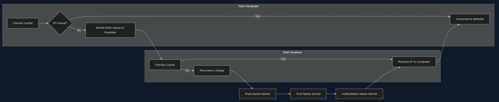
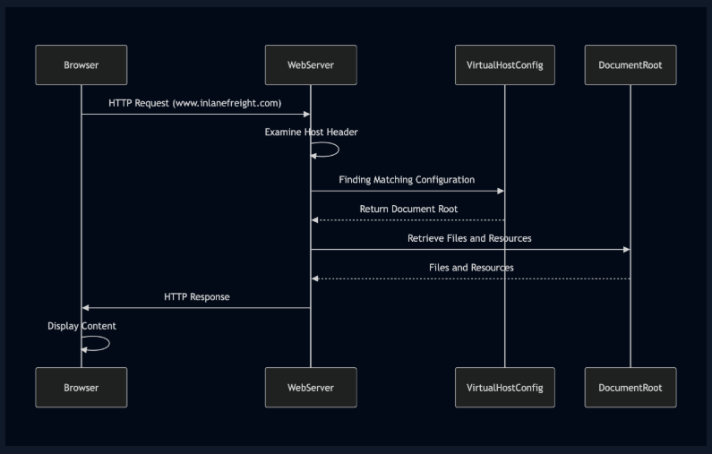

## Table of Contents
- [Introduction](#introduction)
- [Types of reconnaissance](#types-of-reconnaissance)
  - [Active recon](#active-recon)
  - [Passive recon](#passive-recon)
- [Whois](#whois)
  - [Utilising whois](#utilising-whois)
    - [Scenario 1: phishing investigation](#scenario-1-phishing-investigation)
    - [Scenario 2: malware analysis](#scenario-2-malware-analysis)
    - [Using whois](#using-whois)
- [DNS](#dns)
  - [How dns works](#how-dns-works)
  - [Hosts file](#hosts-file)
  - [Key dns concept](#key-dns-concept)
  - [DNS tools](#dns-tools)
    - [dig](#dig)
- [Subdomains](#subdomains)
  - [Subdomain enumeration](#subdomain-enumeration)
    - [Active subdomain enumeration](#active-subdomain-enumeration)
    - [Passive subdomain enumeration](#passive-subdomain-enumeration)
  - [Subdomain bruteforcing](#subdomain-bruteforcing)
  - [DNSEnum](#dnsenum)
- [DNS zone transfer](#dns-zone-transfer)
  - [Exploit zone transfer](#exploit-zone-transfer)
- [Virtual hosts](#virtual-hosts)
  - [Server vhost lookup](#server-vhost-lookup)
  - [Types of virtual hosting](#types-of-virtual-hosting)
  - [Discovery tools](#discovery-tools)
    - [gobuster](#gobuster)
- [Certificate transparency logs](#certificate-transparency-logs)
  - [Searching CT logs](#searching-ct-logs)
- [Well-known URIs](#well-known-uris)
- [Creepy crawlies](#creepy-crawlies)
  - [Popular web crawlers](#popular-web-crawlers)
  - [Scrapy](#scrapy)
- [Search Engine Discovery](#search-engine-discovery)
  - [Search Operators](#search-operators)
  - [Google dorking](#google-dorking)
- [Web archives](#web-archives)
  - [How does the wayback machine work?](#how-does-the-wayback-machine-work)
  - [Why the Wayback Machine Matters for Web Reconnaissance](#why-the-wayback-machine-matters-for-web-reconnaissance)
- [Automating recon](#automating-recon)

# Introduction

Web reconnaissance is the foundation of a sec assessment, collezionare 
informazioni rigurdanti il website target o applicazione web. Parte fondamentale della fase di *Information gathering*.

Obiettivi primari del web recon:
-  identifying assets
- discovering hidden information
- analysing the attack surface
- gathering intelligence
 
## Types of reconnaissance
### Active recon
Attaccante intereagisce direttamente col sistema target per raccogliere info.

Tecniche:
- port scanning: nmap, masscan,unicornscan - alto rischi detection
- vulnerability scanning: nessun, openvas, nikto - alto rischi detection
- network mapping: nmap, traceroute - alto/medio rischio di detection
- banner grabbing: netcat, curl - basso rischio detection
- Os fingerprinting: nmap, xprobe2 - basso rischio detection
- service enumeration: nmap - basso rischio detection
- web spidering: burp, owasp zap spider, scrapy -  basso/medio rischio detection

### Passive recon
Non intereagire direttamente con il target

Tecniche:
- search engine queries: rischio molto basso
- whois lookups: rischio molto basso
- dns: rischio molto basso
- web archive analysis: rischio molto basso
- social media analysis: rischio molto basso
- code repositories: rischio molto basso

# Whois
Protocollo creato per accedere ai database che raccolgono info su risorse internet. Come elenco telefonico gigante di internet.

Each WHOIS record typically contains the following information:
- Domain Name: The domain name itself (e.g., example.com)
- Registrar: The company where the domain was registered (e.g., GoDaddy, Namecheap)
- Registrant Contact: The person or organization that registered the domain.
- Administrative Contact: The person responsible for managing the domain.
- Technical Contact: The person handling technical issues related to the domain.
- Creation and Expiration Dates: When the domain was registered and when it's set to expire.
- Name Servers: Servers that translate the domain name into an IP address.

Viene usato per identificare dati sul personale, sull'infrasturttura utilizzata.

# Utilising whois

## Scenario 1: phishing investigation
Un sistema di sicurezza per la posta elettronica segnala un'email sospetta inviata a diversi dipendenti di un'azienda. L'email afferma di provenire dalla banca aziendale e invita i destinatari a cliccare su un link per aggiornare le informazioni del proprio conto. Un analista della sicurezza esamina l'email e inizia eseguendo una ricerca WHOIS sul dominio indicato nel messaggio.
Il record WHOIS rivela quanto segue: Data di registrazione: il dominio è stato registrato solo pochi giorni fa. Registrante: le informazioni del registrante sono nascoste dietro un servizio di privacy. Server dei nomi: i server dei nomi sono associati a un noto provider di hosting "a prova di proiettile" spesso utilizzato per attività dannose. Questa combinazione di fattori solleva significativi segnali di allarme per l'analista. La recente data di registrazione, le informazioni del registrante nascoste e l'hosting sospetto suggeriscono fortemente un tentativo di phishing. L'analista avvisa il dipartimenti IT di bloccare il dominio e di avvisare lo scam.

## Scenario 2: malware analysis
Un ricercatore di sicurezza sta analizzando una nuova variante di malware che ha infettato diversi sistemi all'interno di una rete. Il malware comunica con un server remoto per ricevere comandi ed esfiltrare i dati rubati. Per ottenere informazioni sull'infrastruttura dell'attore della minaccia, il ricercatore esegue una ricerca WHOIS sul dominio associato al server di comando e controllo (C2). Il record WHOIS rivela: 
- Registrante: Il dominio è registrato a nome di un individuo che utilizza un servizio di posta elettronica gratuito noto per l'anonimato.
- Location: registrant address is in a country with high cybercrime
- Registrar: domain registered through a registrar with a history of lax abuse policies

Quindi, il ricercatore conclude che il server C2 è probabilmente ospitato su un server compromesso. Il ricercatore utilizza quindi i dati WHOIS per identificare il provider di hosting e notificarlo dell'attività dannosa.

## Using whois
1. Domain Registration:
Registrar: RegistrarSafe, LLC
Creation Date: 1997-03-29
Expiry Date: 2033-03-30
These details indicate that the domain is registered with RegistrarSafe, LLC, and has been active for a considerable period, suggesting its legitimacy and established online presence. The distant expiry date further reinforces its longevity.

2. Domain Owner:
Registrant/Admin/Tech Organization: Meta Platforms, Inc.
Registrant/Admin/Tech Contact: Domain Admin

This information identifies Meta Platforms, Inc. as the organization behind facebook.com, and "Domain Admin" as the point of contact for domain-related matters. This is consistent with the expectation that Facebook, a prominent social media platform, is owned by Meta Platforms, Inc.

3. Domain Status:
clientDeleteProhibited, clientTransferProhibited, clientUpdateProhibited, serverDeleteProhibited, serverTransferProhibited, and serverUpdateProhibited

These statuses indicate that the domain is protected against unauthorized changes, transfers, or deletions on both the client and server sides. This highlights a strong emphasis on security and control over the domain.

4. Name Servers:
A.NS.FACEBOOK.COM, B.NS.FACEBOOK.COM, C.NS.FACEBOOK.COM, D.NS.FACEBOOK.COM

These name servers are all within the facebook.com domain, suggesting that Meta Platforms, Inc. manages its DNS infrastructure. It is common practice for large organizations to maintain control and reliability over their DNS resolution.

# DNS
Converte dominio human-readable in indirizzi ip che i pc usano per comunicare.

## How dns works

1. Your Computer Asks for Directions (DNS Query): first check local pc memory cache per vedere se è in memoria l'ip da una visita precedente
2. The DNS Resolver Checks its Map (Recursive Lookup): inizia percorso per gerarchia dns
3. Root Name Server Points the Way: indirizzo verso il corretto tld name server (.com, .org,...)
4. TLD Name Server Narrows It Down: conosce quale auth name server è responsabile di un certo dominio e manda il resolver là
5. Authoritative Name Server Delivers the Address:  contiene ip che cerchiamo e lo ritorna al resolver 
6. The DNS Resolver Returns the Information: resolver riceve ip e lo invia al mio pc
7. Your Computer Connects

Il computer riceve il nome di dominio e lo inoltra al resolver. Il resolver, a sua volta, trasmette la richiesta al server root, al server TLD e infine al server autoritativo, avvicinandosi sempre di più alla destinazione. Una volta trovato l'indirizzo IP, questo viene ritrasmesso lungo la catena fino al tuo computer, consentendoti di accedere al sito web.

## Hosts file
Located in /etc/hosts: map ip - hostname , bypassa il processo dns

## Key dns concept
1. Zone DNS e Zone File

Zona DNS: È una porzione distinta dello spazio dei nomi di dominio gestita da un'entità o un amministratore specifico (un "contenitore virtuale", es. example.com e i suoi sottodomini mail.example.com o blog.example.com).

Zone File: È il file di testo residente sul server DNS che definisce i Resource Record all'interno della zona, fornendo le informazioni necessarie per tradurre i nomi di dominio in indirizzi IP.

2. Componenti dell'Infrastruttura DNS
- Domain Name: Etichetta leggibile per identificare una risorsa web, es www.example.com
- IP Address: Identificatore numerico univoco per ciascun dispositivo.192.0.2.1
- DNS Resolver: Server che traduce i nomi di dominio in indirizzi IP per il client. Resolver ISP locale o pubblico (es. Google 8.8.8.8)
- Root Name Server: Server al vertice della gerarchia DNS (13 al mondo, nominati da A a M).a.root-servers.net
- TLD Name Server: Server responsabili dei domini di primo livello (.com, .org, ecc.).Verisign per .com
- Authoritative Name Server: Server che detiene l'indirizzo IP effettivo e ufficiale per un dominio.Server del provider di hosting o registrars.
- DNS record types: tipi di informazioni contenuto nel dns, A, AAAA, CNAME, MX, NS, TXT, SOA, PTR, SRV

3. Tipi di Record DNS (Resource Records)
I record archiviano dati specifici associati ai nomi di dominio:
- A (Address Record): Associa un hostname a un indirizzo IPv4 (es. 192.0.2.1).
- AAAA (IPv6 Address Record): Associa un hostname a un indirizzo IPv6.
- CNAME (Canonical Name): Crea un alias, facendo puntare un hostname a un altro hostname.
- MX (Mail Exchange): Specifica i server di posta responsabili per il dominio.
- NS (Name Server): Delega la zona DNS a uno specifico server dei nomi autorevole.
- TXT (Text Record): Contiene testo arbitrario (spesso usato per verifiche di dominio e politiche di sicurezza come SPF/DKIM).
- SOA (Start of Authority): Contiene informazioni amministrative sulla zona (server primario, email del responsabile, parametri di refresh/ttl).
- SRV (Service Record): Definisce l'hostname e la porta per servizi specifici (es. SIP, XMPP).
- PTR (Pointer Record): Usato per la risoluzione inversa (Reverse DNS), associando un IP a un hostname.

Nei file di zona, la stringa IN sta per Internet. È un campo di classe che indica che il record appartiene alla famiglia di protocolli Internet standard (IP).

Importante per Web recon perche:
- uncovering assets: look for cname record
- mapping to netw infrastructure: look for ns, a record
- monitoring for change: txt record potrebbe contenere info importanti

## DNS tools
- dig
- nslookup
- host
- dnsenum
- fierce
- dnsrecon
- theHarvester

### dig
- dig +trace domain.com: full path of dns resolution
- dig -x ip: reverse lookup

# Subdomains
Durante esplorazione dns, focus sul dominio principale, ma anche su potenziali sotto domini. Perchè sono inportanti?
- development and staging environments: sottodomini usati per test nuove feature, spesso contengono vulnerabilita
- hidden login portals
- legacy applications
- sensitive information

## Subdomain enumeration
Tipicamente un sottodominiio è rappresentato dai record A, AAAA, anche CNAME. Due approcci per fare subdomain enumeration: passivo e attivo.

### Active subdomain enumeration
Tentare un *DNS zone transfer*. Un alternativa è fare brute-force enumeration, in cui si testa una lista di potenziali sotto domini su un target domain, con strumenti come dnsenum, ffuf, gobuster

### Passive subdomain enumeration
Certificate transparency (ct) logs, public repositories of ssl/tls certificates. Oppure con motori di ricerca classici utilizzando l'operatore *site:* per filtrare solo per sottodomini relativi al dominio target.

# Subdomain bruteforcing
Questo processo si divide in quattro step:
1. wordlist selection
2. iteration and querying: tool iterates through the wordlist (dnsenum, fierce, dnsrecon, amass, assetfinder, puredns)
3. DNS lookup: perform dns query per ogni potenziale sottodominio
4. filtering and validation

## DNSEnum
written in perl, for dns reconnaissance, offre diverse funzioni:
- dns record dnumeration
- zone transfer attempts
- subdomain brute-forcing
- google scraping
- reverse lookup
- whois lookup

# DNS zone transfer
Less invasive and potentially more efficient method for uncovering subdomains -> dns zone transfer. Copi dei record dns in una zona da un server ad un altro (solitamente usato per mentenere consistenza e ridondanza fra dns servers).

1. Zone Transfer Request (AXFR): The secondary DNS server initiates the process by sending a zone transfer request to the primary server. This request typically uses the AXFR (Full Zone Transfer) type.
2. SOA Record Transfer: Upon receiving the request (and potentially authenticating the secondary server), the primary server responds by sending its Start of Authority (SOA) record. The SOA record contains vital information about the zone, including its serial number, which helps the secondary server determine if its zone data is current.
3. DNS Records Transmission: The primary server then transfers all the DNS records in the zone to the secondary server, one by one. This includes records like A, AAAA, MX, CNAME, NS, and others that define the domain's subdomains, mail servers, name servers, and other configurations.
4. Zone Transfer Complete: Once all records have been transmitted, the primary server signals the end of the zone transfer. This notification informs the secondary server that it has received a complete copy of the zone data.
5. Acknowledgement (ACK): The secondary server sends an acknowledgement message to the primary server, confirming the successful receipt and processing of the zone data. This completes the zone transfer process.

## Exploit zone transfer
- dig axfr @nsztm1.digi.ninja zonetransfer.me: zone transfer from dns server responsible for zonefransfer.me

# Virtual hosts
1. Come fa un singolo server ad ospitare più siti? (Virtual Hosting)
Quando il DNS risolve un nome di dominio, fornisce solo l'indirizzo IP del server. Se un server gestisce 10 siti diversi sullo stesso indirizzo IP, come fa a sapere quale sito mostrare all'utente?
Lo fa leggendo l'Header Host: inviato dal browser nella richiesta HTTP. Il web server (Apache, Nginx, IIS) legge questo header, consulta le sue regole interne (Virtual Host / VHost) e serve i file della cartella corrispondente a quel dominio o sottodominio.

2. Sottodomini vs Virtual Host (VHost)
Sottodominio (Livello DNS): È un'estensione del dominio principale (es. blog.example.com). Esiste nei file di zona DNS ufficiali ed è visibile a chiunque interroghi la rete.
Virtual Host (Livello Web Server): È una configurazione interna del web server. Un VHost può essere associato a un intero dominio (sito.com) o a un sottodominio (dev.sito.com).
Punto Chiave: Un server può avere un Virtual Host configurato per admin.example.com, ma l'amministratore potrebbe non aver creato il record DNS pubblico. Di conseguenza, il dominio non risolve via internet, ma il server web è già pronto ad accettare richieste per quel nome.

3. Aggirare il DNS con il file /etc/hosts
Se un VHost interno non ha un record DNS pubblico, puoi comunque accedervi forzando la risoluzione sul tuo computer. Modificando il file locale hosts (/etc/hosts su Linux/macOS o C:\Windows\System32\drivers\etc\hosts su Windows), mappi direttamente l'IP al nome del VHost

4. Che cos'è il VHost Fuzzing?

Durante una fase di Web Reconnaissance, la ricerca dei sottodomini sui DNS pubblici potrebbe non mostrare gli ambienti interni, di sviluppo o di staging (es. dev.azienda.com, test.azienda.com,..).Il VHost Fuzzing è una tecnica che invia centinaia o migliaia di richieste HTTP allo stesso indirizzo IP, cambiando ad ogni richiesta unicamente l'header Host: con parole prese da una wordlist:
- Richiesta 1: Host: admin.example.com $\rightarrow$ Risposta: 404 Not Found (o pagina di default)
- Richiesta 2: Host: dev.example.com $\rightarrow$ Risposta: 200 OK (VHost Trovato!)

## Server vhost lookup

1. Browser Requests a Website: When you enter a domain name (e.g., www.inlanefreight.com) into your browser, it initiates an HTTP request to the web server associated with that domain's IP address.
2. Host Header Reveals the Domain: The browser includes the domain name in the request's Host header, which acts as a label to inform the web server which website is being requested.
3. Web Server Determines the Virtual Host: The web server receives the request, examines the Host header, and consults its virtual host configuration to find a matching entry for the requested domain name.
4. Serving the Right Content: Upon identifying the correct virtual host configuration, the web server retrieves the corresponding files and resources associated with that website from its document root and sends them back to the browser as the HTTP response.

## Types of virtual hosting
1. Named-based virtual hosting: si affida a http host header per distinguere fra siti web, il più flessibile, e facile la gestire

2. ip-based virtual hosting: metodo che assegna un ip ad ogni sito web, non si basa su host header, più expensive e meno scalabile

3. port-based virtual hosting: siti web diversi associati a porte diverse sullo stesso ip, richiede di specificare la porta nell'url

## Discovery tools
### gobuster
- gobuster vhost -u http://<target_IP_address> -w <wordlist_file> --append-domain: -u specifica url target con l'ip, -k ignore errori di certificati ssl/tls, -t aumenta numero threads per scan piu veloci, -o per salvare output in un file, --append-domain

# Certificate transparency logs
SSL/TLS protocollo pilastro portante dei meccanismi di sicurezza in internet, cifra comunicazione fra browser e website. Il cuore di questi protocolli prevede lo scambio di certificati digitali. Qui entra in gioco il certificate transparency logs.

Certificate Transparency (CT) logs sono registri pubblici che documentano l'emissione dei certificati SSL/TLS. Ogni volta che un'Autorità di Certificazione (CA) emette un nuovo certificato, deve registrarlo in più registri CT. Questi registri sono gestiti da organizzazioni indipendenti e sono accessibili a chiunque per la consultazione. 

Questa trasparenza serve a fare early detection of rogue certificates, accountability for CA, strengthening the web PKI (pub key infrastructure)

## Searching CT logs
- crt.sh: identifica sotto domini, check certificate issuance history
- Censys

Esempio: curl -s "https://crt.sh/?q=facebook.com&output=json" | jq -r '.[] | sort -u

# Well-known URIs
Lo standard .well-known (definito nella RFC 8615) è una directory standardizzata situata nella radice di un sito web (/.well-known/).

Punti chiave:
Scopo: Centralizzare metadati, file di configurazione e informazioni critiche relative ai servizi, protocolli e meccanismi di sicurezza del sito.

Funzione: Semplificare l'individuazione e l'accesso automatizzato a questi file da parte di browser, applicazioni e tool di sicurezza tramite un URL prevedibile.

L'internet assigned numbers authority [IANA](https://www.iana.org/assignments/well-known-uris/well-known-uris.xhtml) mantiene un registro dei well-known uris, per esempio security.txt, openid-configuration, assetlinks.json, mta-sts.txt, ecc.

Un uri utile è openid-configuration, fa parte del OpenID Connect Discovery protocol, uno strato costruito sopra OAuth 2.0 protocol. Quando un client vuole usare openid connect per autenticarsi, accede all'endpoint .well-known/openid-configuration che ritorna un documento json contenente metadata sul provider.

Esplorare il registro IANA e sperimentare con i vari URI .well-known è un approccio prezioso per scoprire ulteriori opportunità di ricognizione web.

# Creepy crawlies
## Popular web crawlers
1. Burp suite spider
2. OWASP ZAP
3. Scrapy
4. Apache Nutch

## Scrapy
Installare con pip install scrapy poi fare wget di ReconSpider.zip e lanciare con python reconspider.py

- pip3 install scrapy
- wget -O ReconSpider.zip https://academy.hackthebox.com/storage/modules/144
- ReconSpider.v1.2.zip
- unzip ReconSpider.zip
- python3 ReconSpider.py http://inlanefreight.htb:34677
- cat results.json

# Search Engine Discovery
Search Engine Discovery (o OSINT via motori di ricerca) è la pratica di utilizzare i motori di ricerca e i loro operatori avanzati (es. Google Dorks) per raccogliere informazioni pubbliche su organizzazioni, individui e infrastrutture web.

- Open Source: Utilizza unicamente dati pubblicamente accessibili, rimanendo un'attività legale e non invasiva.
- Ampiezza dei dati: I motori di ricerca indicizzano miliardi di pagine, offrendo una panoramica vastissima.
- Accessibilità e costi: È una risorsa gratuita che non richiede infrastrutture complesse.

Ambiti di applicazione:
- Security Assessment: Individuazione di vulnerabilità, documenti sensibili indicizzati per errore, pagine di login nascoste o credenziali esposte.
- Threat Intelligence: Monitoraggio dei vettori d'attacco emergenti e tracciamento delle attività di attori malevoli.
- Competitive Intelligence: Analisi delle strategie, dei prodotti e delle infrastrutture dei competitor.
- Giornalismo Investigativo: Ricostruzione di relazioni, transazioni finanziarie e dati aziendali non evidenti.

Limiti della tecnica:
I motori di ricerca non indicizzano l'intero web (es. pagine protette da autenticazione, contenuti dinamici o risorse esplicitamente escluse via robots.txt). Pertanto, la ricerca va sempre integrata con altri strumenti di Web Reconnaissance.

## Search Operators
- site:exaple.com trova tutti i siti example.com
- inurl:login(oppure /admin) cerca login/admin pages su tutti i websites
- filetype:pdf trova pdf scaricabili
- intitle:"titolox" cerca per documenti con "titolox"
- cache:example.com
- link:example.com
- related:example.com
- info:example.com
- define:phishing
- site:example.com numrange:1000-2000
- allintext:admin password reset
- allinurl:admin panel
- allintitle:confidential report 2023
- site:example.com AND (inurl:admin OR inurl:login)

## Google dorking 
Google Dorking, noto anche come Google Hacking, è una tecnica che sfrutta il potere degli operatori di ricerca per scoprire informazioni sensibili, vulnerabilità di sicurezza o contenuti nascosti sui siti web, utilizzando Google Ricerca [Google dorking]https://www.exploit-db.com/google-hacking-database

# Web archives
Grazie alla Wayback Machine dell'Internet Archive, abbiamo un'opportunità unica per rivisitare il passato ed esplorare le tracce digitali dei siti web così come erano un tempo [wayback](https://web.archive.org/).

## How does the wayback machine work?
1. Crawling: si usano web crawler bots per navigare internet
2. Archiving: i siti web assieme a tutte le varie risorse vengono archiviati.
3. Accessing: utenti possono accedere a questi archivi attraverso l'interfaccia di wayback machine.

## Why the Wayback Machine Matters for Web Reconnaissance
1. Uncovering Hidden Assets and Vulnerabilities:
2. Tracking Changes and Identifying Patterns
3. Gathering Intelligence
4. Stealthy Reconnaissance

# Automating recon
L'automazione della Web Reconnaissance sostituisce i processi manuali con script e framework per raccogliere informazioni in modo più rapido, accurato e scalabile.

Vantaggi dell'Automazione
- Efficienza e Scalabilità: Esegue scansioni su centinaia di target contemporaneamente, riducendo i tempi di analisi.
- Consistenza: Segue regole predefinite, garantendo risultati riproducibili ed eliminando gli errori umani.
- Copertura e Integrazione: Combina DNS enumeration, port scanning e web crawling, integrandosi facilmente con altri tool di vulnerability assessment.

Principali Framework di Automazione:
- FinalRecon: Tool Python modulare per l'analisi veloce di certificati SSL, intestazioni HTTP, informazioni Whois e web crawling.
- Recon-ng: Framework Python con interfaccia in stile Metasploit; usa moduli indipendenti per enumerazione DNS, OSINT e identificazione di vulnerabilità.
- theHarvester: Specializzato nell'estrazione di email, sottodomini, IP, porte e nomi di dipendenti da fonti pubbliche (motori di ricerca, PGP, Shodan).
- SpiderFoot: Piattaforma di OSINT automatizzata che mappa la presenza digitale di un target interrogando centinaia di fonti dati trasversali
- OSINT Framework: Una mappa interattiva sul web che raccoglie e categorizza i migliori tool e risorse per l'Open Source Intelligence.

crirom00@htb[/htb]$ git clone https://github.com/thewhiteh4t/FinalRecon.git
crirom00@htb[/htb]$ cd FinalRecon
crirom00@htb[/htb]$ pip3 install -r requirements.txt
crirom00@htb[/htb]$ chmod +x ./finalrecon.py
crirom00@htb[/htb]$ ./finalrecon.py --help