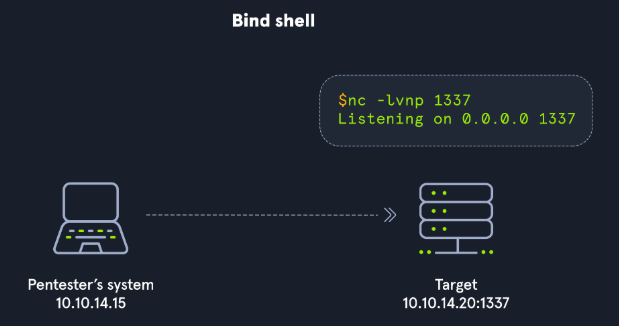
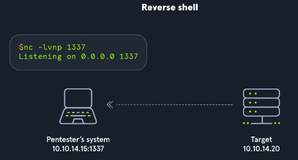

# Table of Contents
- [Shells Jack Us In, Payloads Deliver Us Shells](#shells-jack-us-in-payloads-deliver-us-shells)
	- [Payload deliver us shells](#payload-deliver-us-shells)
- [Anatomy of a shell](#anatomy-of-a-shell)
- [Bind shells](#bind-shells)
	- [What is it?](#what-is-it)
	- [Practicing with GNU Netcat](#practicing-with-gnu-netcat)
		- [No. 1: Server - Target starting Netcat listener](#no-1-server---target-starting-netcat-listener)
		- [No. 2: Client - Attack box connecting to target](#no-2-client---attack-box-connecting-to-target)
		- [No. 3: Server - Target receiving connection from client](#no-3-server---target-receiving-connection-from-client)
		- [No. 4: Client - Attack box sending message Hello Academy](#no-4-client---attack-box-sending-message-hello-academy)
		- [No. 5: Server - Target receiving Hello Academy message](#no-5-server---target-receiving-hello-academy-message)
	- [Establishing a Basic Bind Shell with Netcat](#establishing-a-basic-bind-shell-with-netcat)
		- [No. 1: Server - Binding a Bash shell to the TCP session](#no-1-server---binding-a-bash-shell-to-the-tcp-session)
		- [No. 2: Client - Connecting to bind shell on target](#no-2-client---connecting-to-bind-shell-on-target)
- [Reverse Shells](#reverse-shells)
	- [Hands-on With A Simple Reverse Shell in Windows](#hands-on-with-a-simple-reverse-shell-in-windows)
		- [Server](#server)

# Shells Jack Us In, Payloads Deliver Us Shells
A shell is a program that provides a computer user with an interface to input instructions into the system and view text output (Bash, Zsh, cmd, and PowerShell, for example). As penetration testers and information security professionals, a shell is often the result of exploiting a vulnerability or bypassing security measures to gain interactive access to a host.

Se non riusciamo a stabilire una shell session, siamo molto limitati nel navigare nella macchina della vittima.
Vedremo le shell sotto tre punti di vista:
1. computing: bash, zsh, cmd, powershell.
2. exploitation & security: shell è il risultato di exploitare una vulnerabilita o bypassare una misura di sicurezza per ottenere accesso alla vittima, eg triggering EternalBlue in windows host.
3. web: simile a una shell standard, con la differenza che sfrutta una vulnerabilità (eg caricare un file o uno script) che consente all'attaccante di impartire istruzioni, leggere e accedere ai file e potenzialmente eseguire azioni distruttive sul sistema host sottostante.

## Payload deliver us shells
Un payload puo essere definito sotto diversi aspetti:
- networking: porzione di dati incapsulati nei pacchetti trasmetti in rete
- basic computing: porzione di instruzioni che definiscono l'azione da intraprendere
- programming: porzione di dati a cui fa riferimento l'istruzione del linguaggio di programmazione   
- exploitation & security: codice creato con lo scopo di sfruttare una vulnerabilita di un sistema.

# Anatomy of a shell
Ogni sistema operativo ha una shell, per interagire con essa dobbiamo usare un applicazione conosciuta come *terminal emulator*, eg windows terminal-windows, putty-windows, xterm-linux, gnome terminal-linux, konsole-linux, terminal-macos,etc.

# Bind shells
Stabilire una shell su un sistema in una rete locale o remota, ovvero prendere il controllo del terminal emulator

## What is it?
il target system ha un listener e aspetta un connessione da parte di un altro sistema. (attaccante).

- There would have to be a listener already started on the target.
- If there is no listener started, we would need to find a way to make this happen.
- Admins typically configure strict incoming firewall rules and NAT (with PAT implementation) on the edge of the network (public-facing), so we would need to be on the internal network already.
- Operating system firewalls (on Windows & Linux) will likely block most incoming connections that aren't associated with trusted network-based applications.

## Practicing with GNU Netcat

### No. 1: Server - Target starting Netcat listener

### No. 2: Client - Attack box connecting to target

### No. 3: Server - Target receiving connection from client

### No. 4: Client - Attack box sending message Hello Academy

### No. 5: Server - Target receiving Hello Academy message

## Establishing a Basic Bind Shell with Netcat
Nel caso precedente non abbiamo propriamente una bind shell perche non possiamo interagire con so o il file system. Vediamo come farlo ora.

### No. 1: Server - Binding a Bash shell to the TCP session
Target@server:~$ rm -f /tmp/f; mkfifo /tmp/f; cat /tmp/f | /bin/bash -i 2>&1 | nc -l targetIP 7777 > /tmp/f

Il comando sopra viene considerato come il payload.

### No. 2: Client - Connecting to bind shell on target
crirom00@htb[/htb]$ nc -nv 10.129.41.200 7777

Target@server:~$  

Bind shell molto più facile da difendere rispetto alle altre.

# Reverse Shells
L'attaccante ha un listener running e il target inizializza la connessione.

1. Perché si preferisce la Reverse Shell:
Bypass del Firewall: Gli amministratori di sistema tendono a bloccare le connessioni in ingresso, rendendo le bind shell difficili da applicare in scenari reali. Tuttavia, spesso trascurano il traffico in uscita.

Funzionamento: L'attaccante avvia un listener sulla propria macchina d'attacco e sfrutta una vulnerabilità sul target (es. Command Injection o File Upload) per forzare la vittima a connettersi verso l'esterno.

2. Payload e Risorse Utili
Reverse Shell Cheat Sheet: Non occorre riscrivere i comandi da zero; esistono repository e strumenti pubblici con elenchi di payload pronti per diversi linguaggi ed ambienti. !
[Reverse shell cheat sheet](https://swisskyrepo.github.io/InternalAllTheThings/cheatsheets/shell-reverse-cheatsheet/)

Consapevolezza e Personalizzazione: Poiché anche i difensori e gli amministratori di rete conoscono questi repository pubblici per configurare SIEM e controlli di sicurezza, spesso è necessario modificare o personalizzare i payload per evitare il rilevamento.

## Hands-on With A Simple Reverse Shell in Windows

### Server 
crirom00@htb[/htb]$ sudo nc -lvnp 443

1. Uso di Porte Comuni (Bypass Firewall Outbound)Scelta della Porta 443 (HTTPS): Impostare il listener su porte standard come la 443 (o 80) riduce il rischio che la connessione in uscita della reverse shell venga bloccata dai firewall locali o di rete, poiché il traffico HTTPS verso l'esterno è quasi sempre consentito nelle reti aziendali.Limite (DPI / Layer 7): I firewall avanzati dotati di Deep Packet Inspection (DPI) possono comunque rilevare la shell anche sulla porta 443, poiché analizzano il contenuto del pacchetto (che non sarà un vero handshake SSL/TLS) e non solo la porta/IP.
2. Limiti di Netcat su Windows e Approccio LOLBASNetcat non è nativo: A differenza di Linux, nc.exe non è presente di default su Windows. Affidarsi a Netcat richiede prima il caricamento del binario sul target, operazione complessa se non si ha già una funzionalità di file upload.Living Off The Land (LOLBAS): È preferibile utilizzare esclusivamente gli strumenti e i linguaggi nativi dell'ambiente bersaglio (come PowerShell e CMD), garantendo maggiore affidabilità ed evitando il trasferimento di file aggiuntivi.
3. Strategia OperativaAnalisi dell'Ambiente: Prima di tentare la reverse shell, occorre verificare quali interpreti e strumenti sono già disponibili sulla macchina vittima.PowerShell One-Liner: Per stabilire la reverse shell da Windows senza installare software esterno, lo standard consiste nell'eseguire un one-liner nativo in PowerShell.

## Client (target)

